# MICA-v3 答辩汇报版可视化结构

> 状态：defense-oriented visual brief
> 本文档用于把 MICA-v3 目标实验方案整理成更适合答辩汇报、组会展示、论文答辩陈述的可视化结构。
> 它强调主线、边界、因果链和审稿风险控制，不代表当前仓库已经完成实现。
> 当前实现状态仍以 `docs/MICA_CURRENT_STATE_AND_PLAN_GAP.md` 和代码为准。

## 1. 开场页：一句话定义

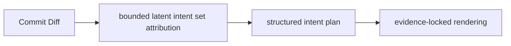

一句话定义：

> MICA-v3 不是 clustering，也不是 commit message generator，而是面向 low-cardinality tangled commits 的 bounded latent intent set attribution。

核心口号：

```text
Attribution is learned.
Generation is rendered.
Faithfulness is verified.
```

### 1.1 一张图讲完整实验路线

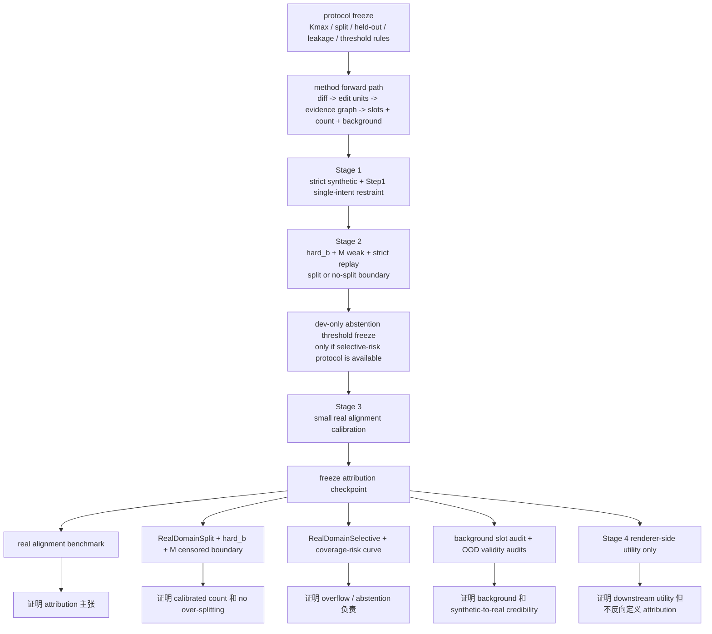

答辩讲法：

- 这张图从左到右就是整篇实验方案，不需要评委自己拼接多个局部图。
- 真正的分水岭在 `freeze attribution checkpoint`：它左边是训练与校准，右边是最终证据。
- `Stage 4 renderer-side utility only` 永远在最右侧，明确它是次级证据，不是主训练接口。

## 2. 为什么要重构问题

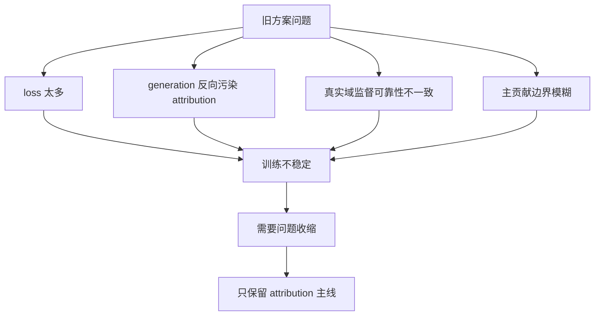

答辩话术：

- 旧问题不是“再调权重就能好”，而是训练目标和论文主张混在了一起。
- 所以 MICA-v3 的第一步不是加模块，而是收缩问题定义。

## 3. 新问题定义

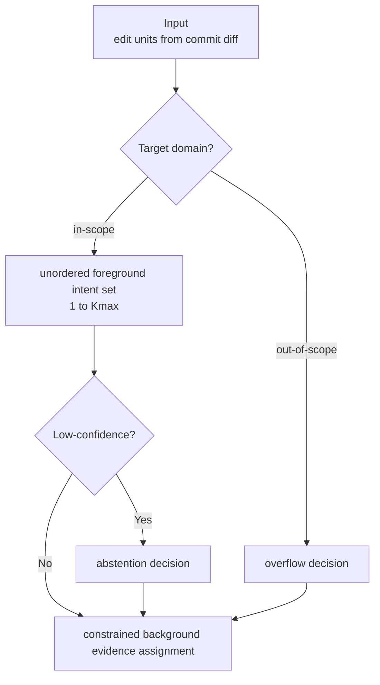

要强调的边界：

- 目标域是 low-cardinality tangled commits，不是任意复杂 commit decomposition。
- 输出不仅是 intent set，还包括 background assignment 与 selective abstention。

## 4. 方案核心结构

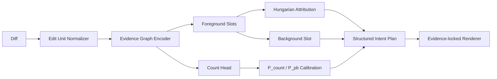

答辩时只需要讲五件事：

1. 先把 diff 变成可归因的 edit units。
2. 用 observable evidence graph 建立结构偏置。
3. 用 bounded latent slots 做 evidence-to-intent attribution。
4. 用 dual-cardinality 处理“到底该拆几个 intent”。
5. 用 frozen intent plan 驱动 downstream rendering，而不是反过来调 attribution。

### 4.1 方法内部完整流

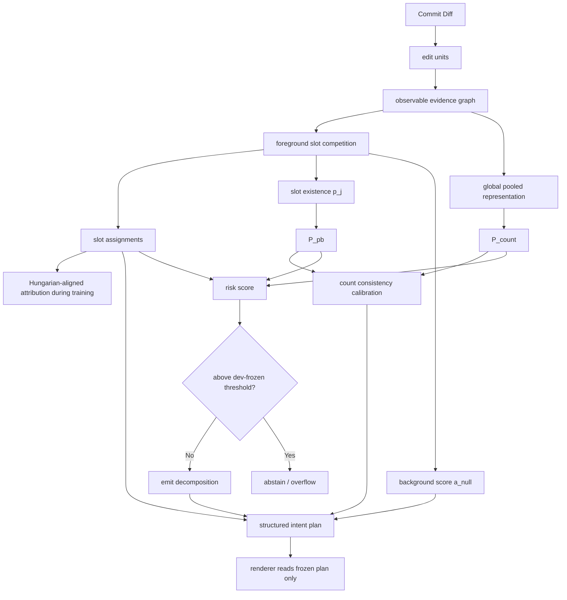

答辩讲法：

- 真正学的对象是 `edit evidence -> intent slots`。
- `count`、`existence`、`background`、`risk` 都是围绕 attribution 主体服务，而不是并列主线。
- renderer 出现在最右侧，是消费结果，不是训练老师。

## 5. 为什么不是 Clustering

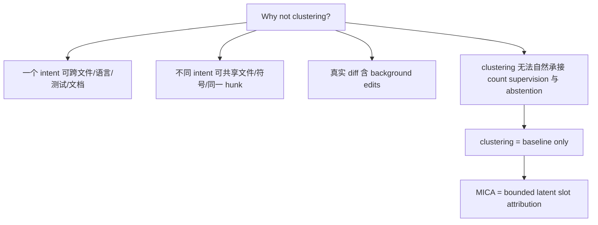

答辩重点：

- clustering 可以做 baseline。
- 但它不是主学习接口，因为它接不住 `count`、`background routing`、`overflow`、`weak real-domain calibration` 这些关键要求。

## 6. Kmax 为什么不是拍脑袋

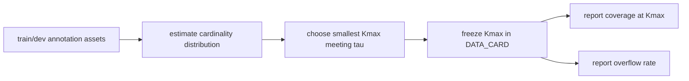

必须明确讲：

```text
Kmax is a task-scope constant, not a tuned model hyperparameter.
synthetic cardinality distribution alone cannot justify Kmax
Kmax=4 is acceptable only if DATA_CARD shows that it covers the intended low-cardinality target domain.
```

答辩防守点：

- `Kmax=4` 不是理论上界，只是默认 bounded-capacity setting。
- `Kmax` 不能根据 final-test performance 或 message utility 调优。
- 如果 DATA_CARD 还没有填入 train/dev `coverage@Kmax`，那 `Kmax=4` 只能被陈述为 implementation default，不能被陈述为 final-paper task boundary。

## 7. Overflow / Abstention 不是“逃避错误”

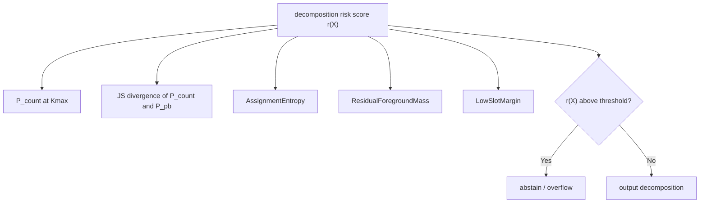

答辩重点：

- overflow / abstention 是 selective prediction，不是后处理借口。
- 阈值只能在 dev 上固定。
- final test 必须报告 coverage-risk curve，而不是只报 covered samples 的 F1。
- 没有 overflow gold 时，它只能被陈述为 calibrated abstention，不是 fully supervised overflow classifier。

## 8. Background Slot 为什么要受约束

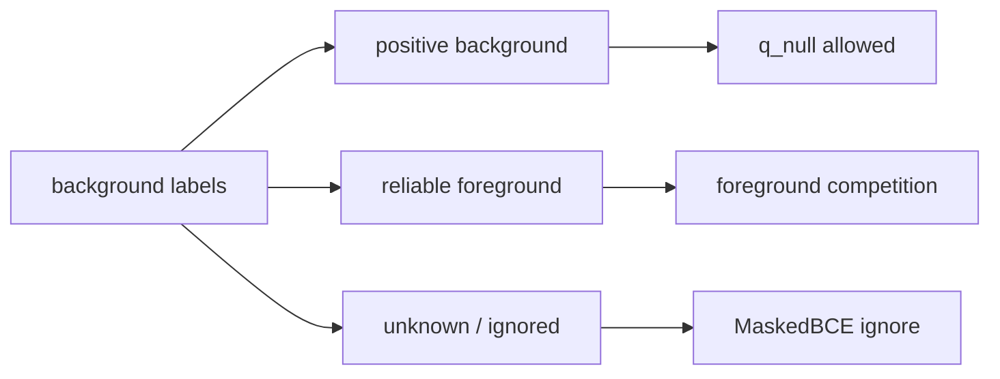

三点必须讲清：

1. background slot 不是困难语义 evidence 的垃圾桶。
2. `L_bg = MaskedBCE(a_null, y_bg, mask_bg)`，不是普通 BCE。
3. semantic edit 没有 background proof 时，不能被当成 background positive。

## 9. 训练协议为什么分 Stage 0-4

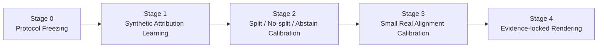

### 9.1 各阶段一句话

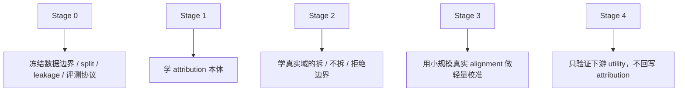

答辩防守点：

- Stage 2 不做 real alignment calibration。
- Stage 3 才做 real alignment calibration。
- renderer 永远不参与 attribution checkpoint selection。
- Stage 2 默认学 split / no-split boundary；只有在 dev overflow/out-of-scope labels 或批准的 dev calibration protocol 存在时，才学习 abstention。

### 9.2 从数据资产到阶段输出

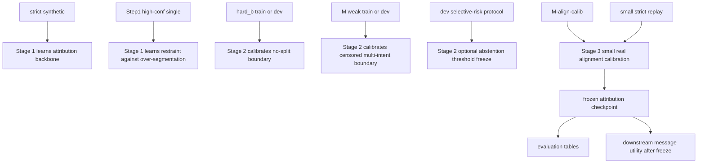

答辩重点：

- synthetic 负责教模型“怎么拆”。
- hard_b 和 M weak 负责教模型“什么时候不要乱拆、什么时候应该识别 multi-intent 边界”。
- small real alignment 负责最后把 attribution 对齐到真实标注，而不是替代前两阶段。

## 10. 为什么 Stage 2 / Stage 3 必须分开

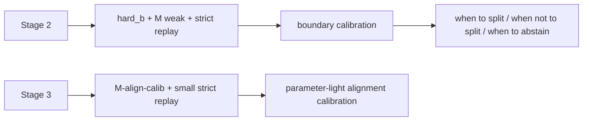

区分理由：

- Stage 2 的监督是弱或边界型监督。
- Stage 3 的监督才是小规模真实 alignment。
- 不分开就会造成“边界校准”和“alignment 校准”概念混淆。

## 11. 评估闭环

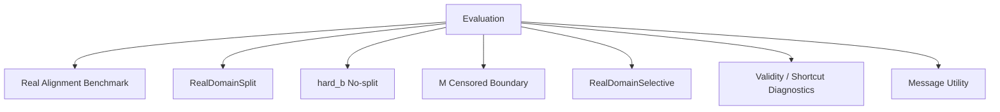

### 11.2 从冻结 checkpoint 到主表证据

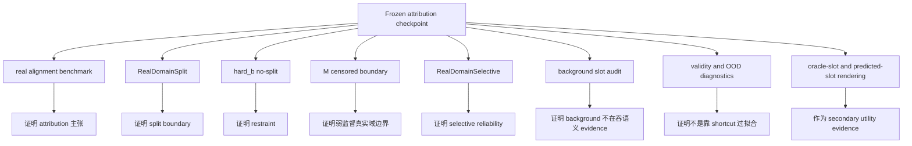

答辩时建议口头强调：

- 主证据是 `real alignment benchmark`，不是 message utility。
- `background slot audit` 必须单列，否则高 attribution 分数也可能不可信。
- `selective evaluation` 是对 overflow / abstention 负责，不是给模型留后门。

### 11.1 五类核心证据

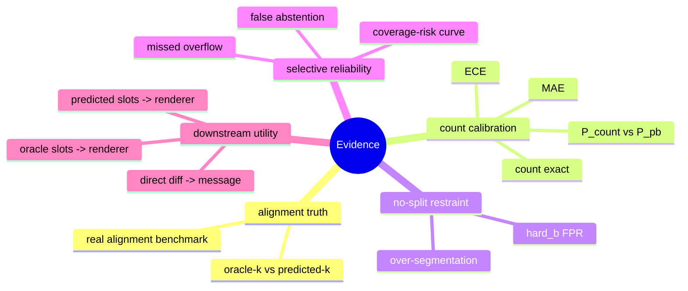

## 12. 最容易被审稿人质疑的地方

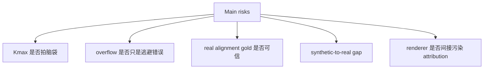

对应回答：

- `Kmax` 用 DATA_CARD 覆盖协议固定。
- overflow 用 selective evaluation 负责。
- real alignment benchmark 需要双标注、裁决和一致性报告。
- synthetic 不是直接当结论，而是通过 real-domain calibration 和 validity audits 验证。
- renderer 完全隔离，不能回写 attribution 选择。

### 12.3 held-out policy 也必须冻结

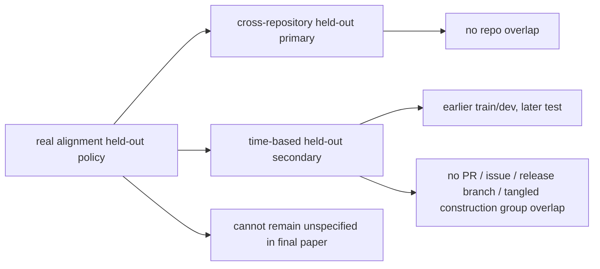

### 12.1 风险-回答对照图

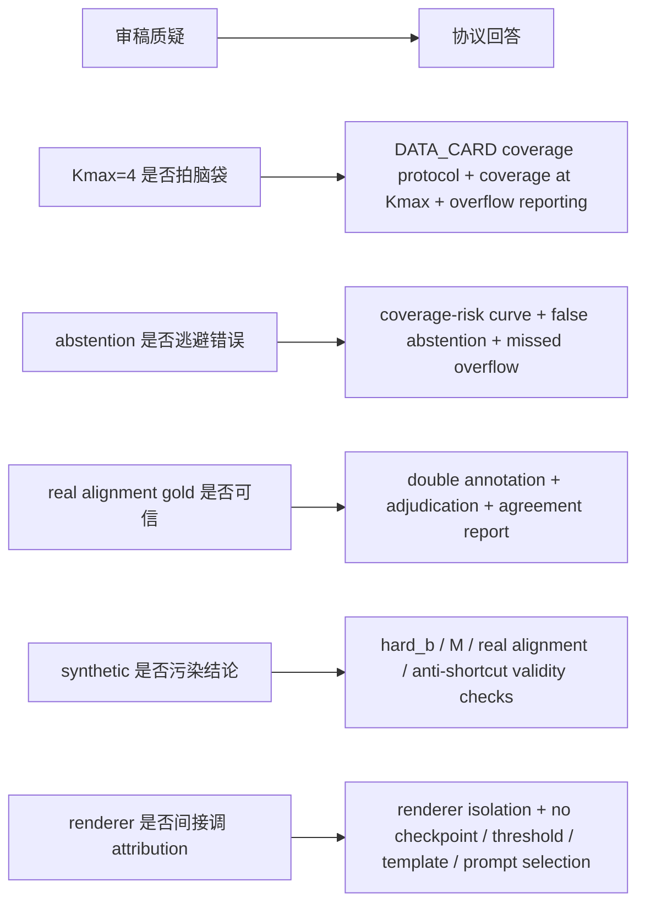

### 12.2 数据可信度闭环

```mermaid
flowchart TD
    A["strict synthetic"] --> B["teaches decomposition"]
    C["Step1 high-conf single"] --> D["teaches restraint"]
    E["hard_b"] --> F["teaches no-split boundary"]
    G["M weak"] --> H["teaches censored multi-intent boundary"]
    I["M-align-calib"] --> J["teaches small real alignment calibration"]
    K["real alignment benchmark"] --> L["validates final attribution claim"]
```

答辩解释：

- synthetic 负责“教会模型怎么拆”。
- real data 负责“教会模型什么时候不该拆、什么时候应该拒绝”。
- 真正的 attribution claim 最终要落到 real alignment benchmark 上。

补充一句：

- 如果 real alignment held-out 策略未冻结，benchmark 的泛化强度就仍然不明确，不能按优秀标准汇报。

### 12.4 selective evaluation 为什么必须单列

```mermaid
flowchart LR
    A["只报 covered attribution score"] --> B["模型可通过大量 abstain 逃避错误"]
    C["补上 coverage-risk curve"] --> D["才知道 coverage 和 risk 的真实权衡"]
    C --> E["可单列 false abstention"]
    C --> F["可单列 missed overflow"]
```

## 13. 最小必要 Baseline

```mermaid
flowchart LR
    A["Baselines"] --> B["B1 single-intent always"]
    A --> C["B2 file/path clustering"]
    A --> D["B3 embedding clustering with oracle-k"]
    A --> E["B4 supervised count-only + heuristic assignment"]
    A --> F["B5 direct generation baseline"]
```

答辩讲法：

- baseline 的作用是定位贡献，不是帮 MICA 调方法。
- `B5` 只服务 message utility，不参与 attribution 主结论。

### 13.1 baseline 作用分工

```mermaid
flowchart TD
    A["B1 single-intent always"] --> A1["证明是否真的识别 multi-intent"]
    B["B2 file/path clustering"] --> B1["检验普通结构聚类是否足够"]
    C["B3 embedding clustering with oracle-k"] --> C1["检验 similarity clustering 上限"]
    D["B4 count-only + heuristic assignment"] --> D1["检验 attribution head 是否必要"]
    E["B5 direct generation baseline"] --> E1["只用于 message utility 参考"]
```

## 14. Claims and Validation 对应图

```mermaid
flowchart TD
    A["Claim 1<br/>synthetic-trained and real-evaluated attribution"] --> A1["real alignment benchmark"]
    A --> A2["oracle-k / predicted-k"]

    B["Claim 2<br/>selective low-cardinality decomposition"] --> B1["count exact / MAE / ECE"]
    B --> B2["P_count vs P_pb"]
    B --> B3["M censored recall"]

    C["Claim 3<br/>avoid over-splitting"] --> C1["hard_b FPR"]
    C --> C2["Step1 restraint transfer"]

    D["Claim 4<br/>selective abstention instead of forced decomposition"] --> D1["coverage-risk"]
    D --> D2["false abstention / missed overflow if labeled"]

    E["Claim 5a<br/>evidence-linked structured plans"] --> E1["assigned evidence"]
    E --> E2["foreground/background audit"]

    F["Claim 5b<br/>downstream rendering utility"] --> F1["predicted slots to renderer"]
    F --> F2["oracle slots to renderer"]
    F --> F3["direct diff to message"]
```

## 15. MVP 和可发表系统的区别

```mermaid
flowchart LR
    A["MVP-Core"] --> A1["能把 attribution 主体跑起来"]
    B["MVP-Plus"] --> B1["把 calibration / abstention / graph bias 补齐"]
    C["Target Paper System"] --> C1["real alignment + Kmax coverage + selective eval + OOD audits + message utility"]
```

必须明确：

```text
If the target is a CCF A-level paper, MVP-Core alone is insufficient.
```

### 15.1 从 MVP 到论文系统的升级路径

```mermaid
flowchart LR
    A["MVP-Core"] --> B["可训练 attribution skeleton"]
    B --> C[MVP-Plus]
    C --> D["boundary calibration + abstention + graph bias"]
    D --> E["Target Paper System"]
    E --> F["real alignment + selective eval + Kmax coverage + OOD audits + message utility"]
```

### 15.2 最低可发表闭环

```mermaid
flowchart TD
    A["minimum publishable target system"] --> B["real alignment evaluation"]
    A --> C["hard_b no-split evaluation"]
    A --> D["Kmax coverage reporting"]
    A --> E["selective attribution evaluation"]
    A --> F["renderer isolation respected"]
```

## 16. Non-negotiable Protocol Constraints

```mermaid
flowchart TD
    A["10 hard constraints"] --> B["Kmax fixed before final evaluation"]
    A --> C["no metadata leakage"]
    A --> D["atomic-source split"]
    A --> E["M weak is censored only"]
    A --> F["hard_b is no-split restraint only"]
    A --> G["background slot is masked three-valued supervision"]
    A --> H["abstention requires coverage-risk metrics"]
    A --> I["renderer metrics cannot select attribution config"]
    A --> J["real alignment is manual or adjudicated gold"]
    A --> K["oracle-k and predicted-k reported separately"]
```

还应口头补充两条：

- background slot 的可信性必须靠 `background assignment rate`、`foreground-to-background error`、`missing-intent rate by file role` 等指标单独审计。
- `protocol_defined` 不等于 `final-paper-ready`；凡是 `values_to_be_populated` 的协议项，在 train/dev calibration 或 metric script 冻结前都不能当成最终实验事实。

### 16.1 常见误解澄清

```mermaid
flowchart TD
    A["Common misunderstandings"] --> B["MICA is a clustering paper"]
    A --> C["MICA is a commit message generation paper"]
    A --> D["M weak provides exact count"]
    A --> E["Stage 2 and Stage 3 are the same thing"]
    A --> F["abstention means failure is ignored"]

    B --> B1["No: clustering is baseline only"]
    C --> C1["No: generation is downstream only"]
    D --> D1["No: M weak is censored k at least 2 only"]
    E --> E1["No: Stage 2 is boundary calibration; Stage 3 is small real alignment calibration"]
    F --> F1["No: abstention must be evaluated with selective metrics"]
```

## 17. 结束页：最终想让评委记住什么

```mermaid
flowchart LR
    A["MICA-v3"] --> B["不是聚类"]
    A --> C["不是生成器"]
    A --> D["不是 joint tuning"]
    A --> E["它是 bounded latent intent set attribution"]
    E --> F["count-aware"]
    E --> G["permutation-invariant"]
    E --> H["evidence-grounded"]
    E --> I["selective and protocol-controlled"]
```

一句话收尾：

> MICA-v3 的价值不在于“生成了一句更好的 message”，而在于它在严格数据协议下学习了一个 bounded、count-aware、evidence-grounded 的 intent attribution layer，并且能够被真实域边界校准与 selective evaluation 可信验证。

### 17.1 最终记忆点压缩版

```mermaid
mindmap
  root((Takeaway))
    bounded
    count-aware
    evidence-grounded
    permutation-invariant
    selective
    protocol-controlled
    rendering-is-downstream
```

## 18. 建议的答辩展示顺序

如果直接拿这份文档做汇报，推荐顺序：

1. `1. 开场页：一句话定义`
2. `2. 为什么要重构问题`
3. `3. 新问题定义`
4. `4-8. 方案核心结构 + Kmax + overflow + background`
5. `9-10. Training protocol 与 Stage 2/3 分工`
6. `11-14. Evaluation / Risks / Claims`
7. `15-17. MVP vs paper system / hard constraints / final takeaway`
