# MICA-v3 实验方案图结构总览

> 状态：reading aid / target protocol map
> 本文档用于把当前 MICA-v3 目标实验方案整理成图结构化视图，便于快速理解。
> 它不是当前实现状态说明，也不替代主方案正文。
> 方案事实边界仍以 `docs/plans/MICA_v3_trainable_algorithm_plan.md`、`docs/plans/MICA_v3_trainable_algorithm_plan_cn.md`、`docs/MICA_CURRENT_STATE_AND_PLAN_GAP.md` 为准。

## 1. 一页总览

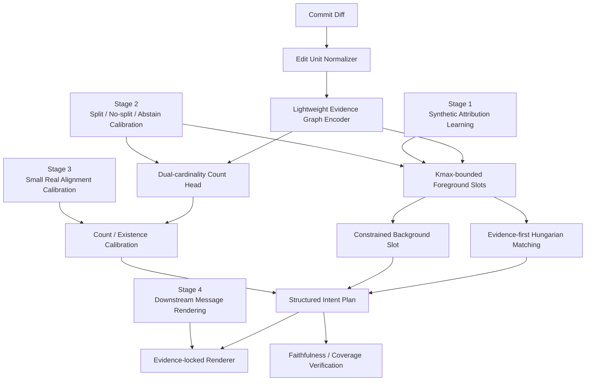

### 1.1 完整实验路线图

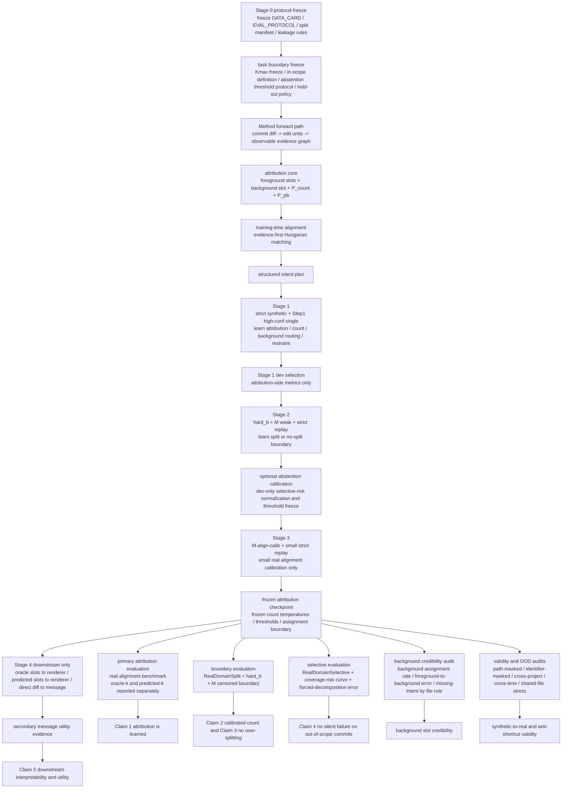

读图方式：

- 先沿主干看 `Stage 0 -> Method forward path -> Stage 1 -> Stage 2 -> Stage 3 -> frozen checkpoint`。
- 再从 `frozen attribution checkpoint` 向右看五类强制评测与一类次级下游评测。
- 最后看最底部 claim 对应，确认每个主张都有单独证据，而不是靠 message utility 代替 attribution 证据。

核心口号：

```text
Attribution is learned.
Generation is rendered.
Faithfulness is verified.
```

## 2. Problem Boundary

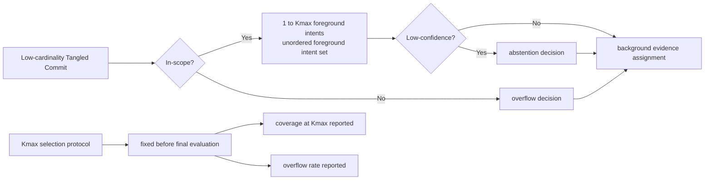

边界解释：

- `Kmax` 是任务边界常量，不是按 test performance 调出来的超参数。
- `Kmax=4` 只能表示默认 bounded-capacity setting。
- `Kmax=4` 只有在 DATA_CARD 冻结 `tau`、`selected_Kmax` 和 train/dev `coverage@Kmax` 后，才能作为 final-paper task boundary。
- `synthetic cardinality distribution alone cannot justify Kmax`。
- `Kmax=4 is acceptable only if DATA_CARD shows that it covers the intended low-cardinality target domain.`。

### 2.2 Kmax freeze protocol 状态

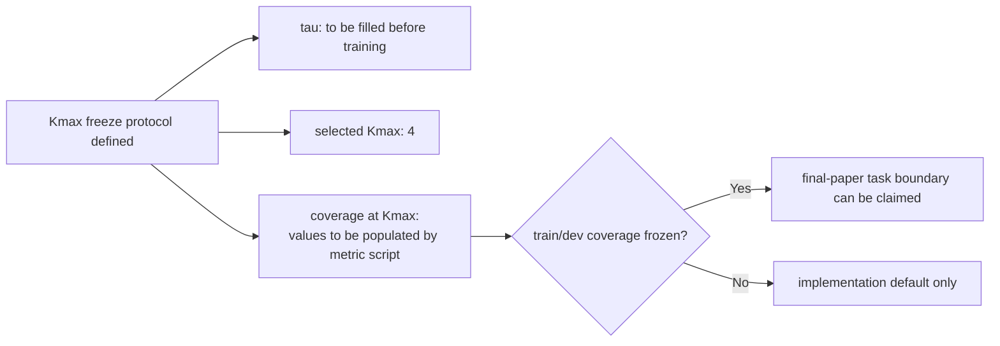

### 2.1 In-scope / Out-of-scope

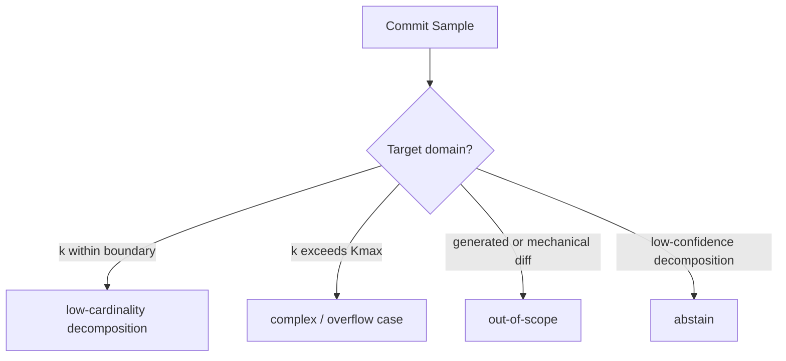


## 3. Method Map

### 3.1 模型结构

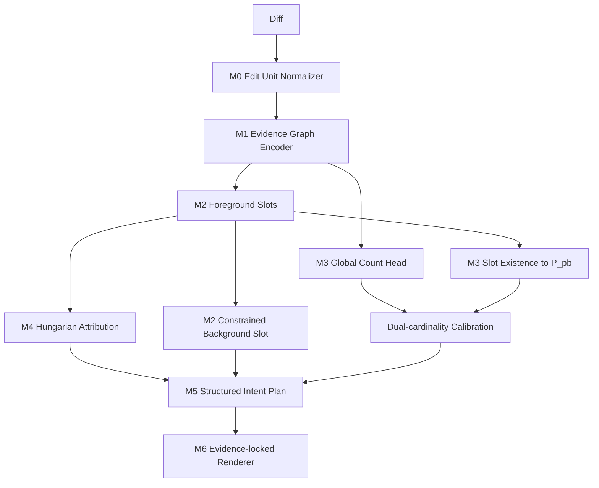


```mermaid
flowchart TD
    %% =========================
    %% Input and Normalization
    %% =========================
    A["Commit Diff<br/>git diff / patch"] --> B["M0 Edit Unit Normalizer<br/>hunk-level / edit-unit level"]

    B --> B1["Edit Units X = {x_i}<br/>unit_id, file_path, hunk_id<br/>old/new span, patch_text<br/>added/deleted/context lines<br/>changed identifiers<br/>file_role, language, source_sha"]

    B --> B2["Function-level Input Context<br/>enclosing symbol type / name / signature<br/>full old symbol text<br/>full new symbol text<br/>resolution status"]

    B1 --> C["M1 Lightweight Evidence Graph Encoder"]
    B2 --> C

    %% =========================
    %% Evidence Graph
    %% =========================
    C --> C1["Observable Relations R<br/>same_file, same_hunk<br/>path_distance, same_identifier<br/>same_language, test_target<br/>doc_refers_to, config/build/lockfile<br/>generated_file"]

    C1 --> C2["Relation Bias / Graph Encoding<br/>H' = Encoder(X, R)<br/>No gold labels<br/>No commit message / PR / issue leakage"]

    %% =========================
    %% Slot Decoder and Count
    %% =========================
    C2 --> D["M2 Bounded Latent Intent Slots<br/>Kmax unordered foreground slots<br/>q_1 ... q_Kmax"]

    C2 --> H["M2 Constrained Background Slot<br/>q_null"]

    C2 --> E["M3 Global Count Head<br/>P_count(k | X)"]

    D --> D1["Slot Assignment Scores<br/>a_ij = softmax(score(x_i, q_j))<br/>foreground slots compete for evidence"]

    D --> F["Slot Existence Head<br/>p_j = sigmoid(exist(q_j))"]

    F --> F1["Poisson-binomial Count<br/>P_pb(k | X) = P(sum Bernoulli(p_j)=k)"]

    E --> I["Dual-cardinality Calibration<br/>L_count + L_pb + L_card_cons<br/>align global count with slot existence"]
    F1 --> I

    %% =========================
    %% Background Routing
    %% =========================
    H --> H1["Three-valued Background Supervision<br/>positive background<br/>reliable foreground<br/>unknown / ignored"]

    H1 --> H2["L_bg = MaskedBCE(a_null, y_bg, mask_bg)<br/>background slot is not a free rejection bucket"]

    D1 --> G["M4 Evidence-first Hungarian Attribution"]
    H2 --> G

    %% =========================
    %% Hungarian Matching
    %% =========================
    G --> G1["Permutation-invariant Matching<br/>predicted foreground slots ↔ gold intents"]

    G1 --> G2["Matching Cost<br/>C_jm = λ_edit C_edit + λ_hunk C_hunk<br/>Default: no type / role / gen / faith signals"]

    G2 --> G3["Attribution Loss<br/>L_align + L_exist<br/>matched slot -> exist=1<br/>unmatched slot -> exist=0<br/>null slot has no L_exist"]

    %% =========================
    %% Selective Risk / Abstention
    %% =========================
    E --> R["Selective Risk Estimator<br/>r(X)"]
    F1 --> R
    D1 --> R
    H2 --> R

    R --> R1["Risk Components<br/>P_count(Kmax)<br/>JS(P_count || P_pb)<br/>AssignmentEntropy<br/>ResidualForegroundMass<br/>LowSlotMargin"]

    R1 --> R2{"r(X) > threshold?<br/>threshold fixed on dev only"}

    R2 -- "Yes" --> R3["Overflow / Abstention<br/>Do not silently force decomposition<br/>Report coverage-risk curve"]
    R2 -- "No" --> J["M5 Structured Intent Plan"]

    %% =========================
    %% Structured Plan
    %% =========================
    I --> J
    G3 --> J
    H2 --> J

    J --> J1["Attribution-core Fields<br/>slot_id<br/>slot_confidence<br/>assigned_edit_units<br/>assigned_hunks<br/>evidence"]

    J1 --> J2["Renderer-facing Derived Fields<br/>type, scope, action, object<br/>derived after attribution<br/>not core supervision targets"]

    J2 --> J3["Diagnostic Metadata<br/>role tags, file roles<br/>background/error flags<br/>not main claims"]

    %% =========================
    %% Renderer
    %% =========================
    J3 --> K["M6 Evidence-locked Renderer"]

    K --> K1["Inputs<br/>frozen structured intent plan<br/>assigned evidence only<br/>no full raw diff as ungrounded context"]

    K1 --> K2["Rendered Output<br/>commit message<br/>per-intent summary<br/>evidence support diagnostics"]

    %% =========================
    %% Hard Isolation Constraints
    %% =========================
    K -. "no gradient" .-> X1["Attribution Model Frozen"]
    K -. "cannot select" .-> X2["No renderer-side checkpoint / threshold / prompt / template selection"]
    K -. "cannot redefine" .-> X3["Renderer cannot redefine count, slots, matching, or attribution"]

    %% =========================
    %% Training Signals
    %% =========================
    subgraph TRAIN["Training Protocol"]
        T0["Stage 0 Protocol Freezing<br/>DATA_CARD, EVAL_PROTOCOL<br/>split manifest, leakage report<br/>Kmax and threshold protocol fixed"]
        T1["Stage 1 Synthetic Attribution Learning<br/>strict synthetic + Step1 high-conf single<br/>L_stage1 = L_attr + L_card + λ_bg L_bg"]
        T2["Stage 2 Real-domain Boundary Calibration<br/>hard_b + M weak + strict replay<br/>split / no-split / abstain boundary<br/>M weak only censored k at least 2"]
        T3["Stage 3 Real Alignment Calibration<br/>M-align-calib + small strict replay<br/>parameter-light calibration only"]
        T4["Stage 4 Rendering<br/>attribution frozen<br/>renderer consumes plan only"]
    end

    T0 --> T1 --> T2 --> T3 --> T4

    T1 -. supervises .-> G3
    T1 -. supervises .-> I
    T1 -. supervises .-> H2
    T2 -. calibrates .-> E
    T2 -. calibrates .-> R
    T3 -. calibrates .-> G
    T4 -. consumes only .-> K

    %% =========================
    %% Evaluation Outputs
    %% =========================
    subgraph EVAL["Evaluation Protocol"]
        V1["Real Alignment Benchmark<br/>count exact / MAE<br/>pairwise F1, B-cubed F1<br/>hunk micro-F1<br/>oracle-k vs predicted-k"]
        V2["RealDomainSplit<br/>k equals 1 versus k at least 2<br/>AUROC, AUPRC<br/>Balanced Acc, ECE<br/>FPR_hard_b"]
        V3["hard_b No-split Evaluation<br/>no-split accuracy<br/>over-segmentation rate"]
        V4["M Censored Boundary Evaluation<br/>censored multi-intent recall<br/>P_count vs P_pb consistency"]
        V5["RealDomainSelective<br/>coverage, risk@coverage, AURC<br/>abstention precision<br/>false abstention / missed overflow"]
        V6["Message Utility<br/>predicted slots -> renderer<br/>oracle slots -> renderer<br/>direct diff -> message"]
    end

    J -. evaluated by .-> V1
    E -. evaluated by .-> V2
    E -. evaluated by .-> V3
    E -. evaluated by .-> V4
    R3 -. evaluated by .-> V5
    K2 -. evaluated by .-> V6

    %% =========================
    %% Non-negotiable Constraints
    %% =========================
    subgraph RULES["Non-negotiable Constraints"]
        N1["No commit message / PR / issue / gold / synthetic metadata leakage"]
        N2["Kmax fixed before final evaluation<br/>justified by DATA_CARD coverage"]
        N3["M weak = censored k at least 2 only<br/>not exact count, not alignment"]
        N4["hard_b = no-split restraint only<br/>not detailed alignment unless annotated"]
        N5["background uses masked supervision<br/>positive / reliable foreground / unknown"]
        N6["covered-only attribution scores are insufficient<br/>must report selective metrics if abstention exposed"]
        N7["renderer metrics cannot select attribution settings"]
    end

    N1 -. constrains .-> C2
    N2 -. constrains .-> D
    N3 -. constrains .-> T2
    N4 -. constrains .-> T2
    N5 -. constrains .-> H2
    N6 -. constrains .-> V5
    N7 -. constrains .-> K
```

### 3.1.1 单样本前向与决策流

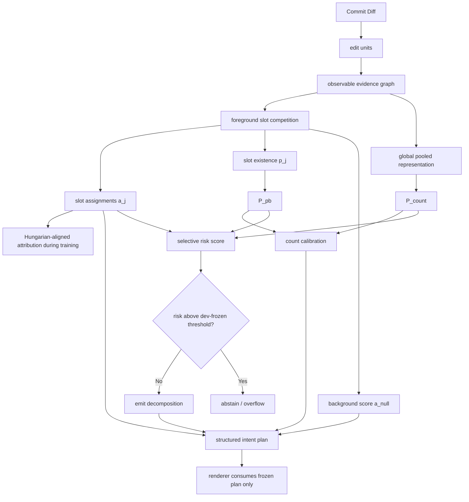

要点：

- `Hungarian matching` 是训练期的 permutation-invariant 对齐接口，不是推理期额外搜索器。
- `P_count`、`P_pb`、assignment uncertainty 共同进入 selective risk，而不是只看单一 count 分数。
- renderer 只消费 plan，不改写 slot、count、matching 或 threshold。

### 3.2 方法定位

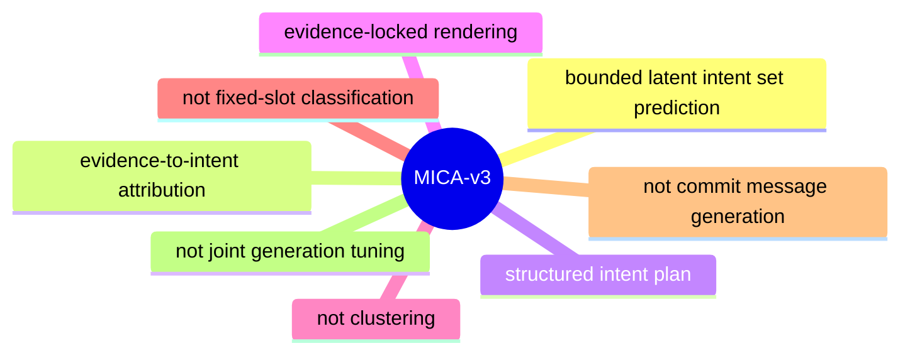

### 3.3 Background Slot 约束

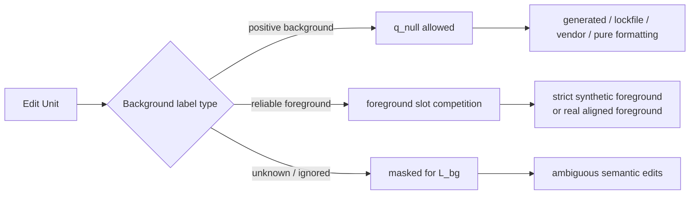

要点：

- `L_bg = MaskedBCE(a_null, y_bg, mask_bg)`。
- background slot 不是困难语义 evidence 的自由拒绝通道。
- semantic edit 没有 background proof 时，不能被当作 background positive。

### 3.4 Primary-intent Attribution 假设

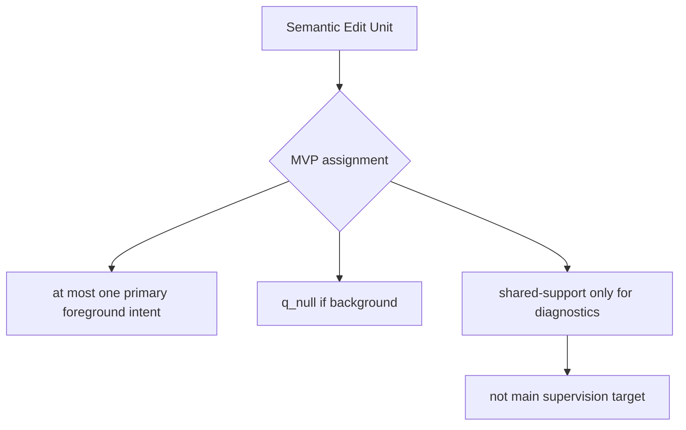

### 3.5 Why Not Clustering

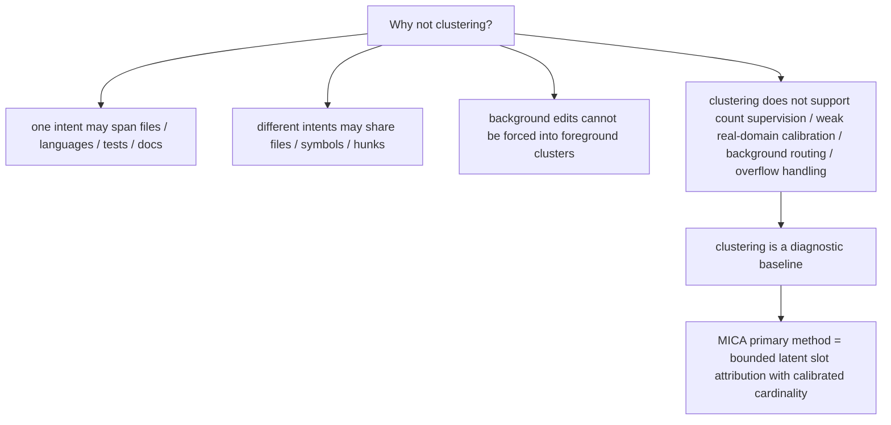

### 3.6 Structured Intent Plan 边界

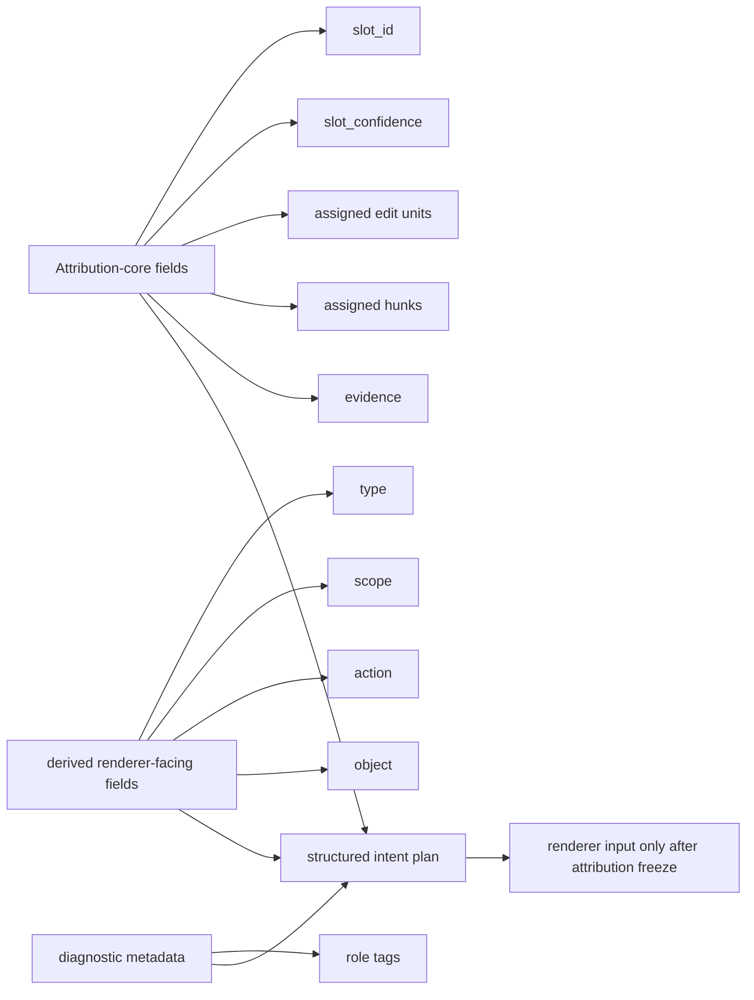

约束：

- `type / scope / action / object` 是 attribution 之后的派生字段，不是 MVP attribution 主监督目标。
- `role tags` 只能作为诊断元数据，不能回流成 matching 或 checkpoint 选择信号。

## 4. Training Protocol Map

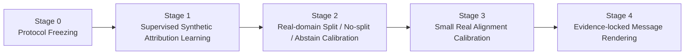

### 4.0 实验主路线图

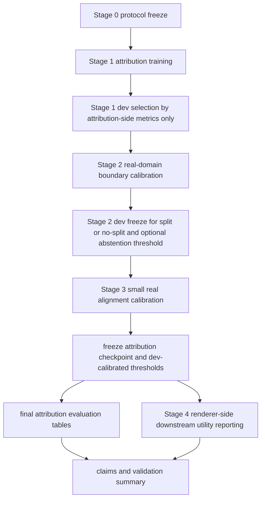

### 4.1 各阶段职责

```mermaid
flowchart TD
    A["Stage 0"] --> A1["freeze DATA_CARD / EVAL_PROTOCOL / split manifest / leakage rules"]
    B["Stage 1"] --> B1["strict synthetic"]
    B --> B2["Step1 high-confidence k=1 restraint"]
    B --> B3["learn attribution / count / slot existence / background routing"]
    C["Stage 2"] --> C1["hard_b"]
    C --> C2["M weak"]
    C --> C3["strict replay"]
    C --> C4["learn split / no-split boundary by default"]
    C --> C5["learn abstain only if dev overflow labels or approved dev calibration protocol exist"]
    D["Stage 3"] --> D1["M-align-calib"]
    D --> D2["parameter-light calibration only"]
    E["Stage 4"] --> E1["renderer reads frozen intent plan"]
    E --> E2["downstream utility only"]
```

### 4.2 Stage 2 / Stage 3 边界

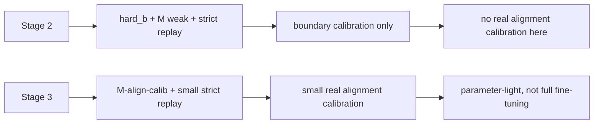

### 4.3 损失结构

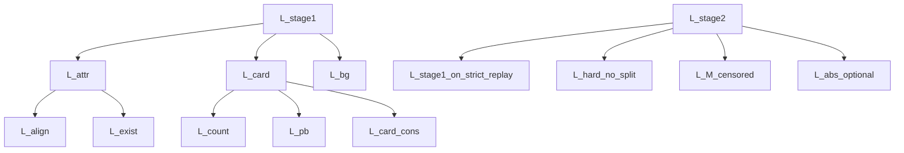

关键约束：

- `M weak` 只能提供 censored `k at least 2` supervision。
- `hard_b` 监督 no-split restraint，不监督 detailed alignment，除非有人工 alignment。
- Step1 高可信单意图不只是预训练补充，还承担 anti-over-segmentation restraint。
- `L_abs_optional` 只有在存在 abstention labels 或批准的 dev calibration protocol 时才启用。

### 4.4 数据监督来源关系

```mermaid
flowchart TD
    A["strict synthetic"] --> A1["L_align"]
    A --> A2["L_exist"]
    A --> A3["exact CE for P_count"]
    A --> A4["exact CE for P_pb"]
    A --> A5["L_bg"]

    B["Step1 high-conf single"] --> B1["k=1 restraint"]
    B --> B2["optional L_align"]
    B --> B3["L_exist if reliable foreground coverage"]

    C["hard_b"] --> C1["no-split boundary calibration"]
    C --> C2["CE for P_count with k=1"]
    C --> C3["optional low-weight CE for P_pb"]

    D["M weak"] --> D1["censored k at least 2 only"]
    D --> D2["no exact count"]
    D --> D3["no alignment supervision"]

    E["M-align-calib"] --> E1["small real alignment calibration"]
    E --> E2["parameter-light Stage 3 only"]
```

解释：

- `strict synthetic` 是 attribution 主监督来源。
- `hard_b` 不是 alignment 数据，而是 no-split restraint 数据。
- `M weak` 不是 exact count 数据，而是 censored multi-intent boundary 数据。
- `M-align-calib` 不能提前混进 Stage 2。

### 4.5 数据资产到阶段输出流

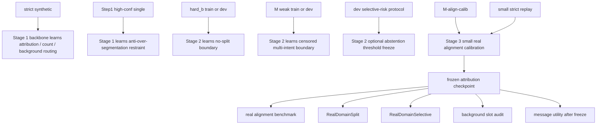

### 4.6 Stage 3 参数冻结边界

```mermaid
flowchart LR
    A["Stage 3 learned parameters"] --> A1["count temperature"]
    A --> A2["slot existence calibration temperature"]
    A --> A3["optional top adapter"]

    C["Stage 3 dev-selected operating parameters"] --> C1["assignment threshold"]
    C --> C2["optional background threshold"]
    C --> C3["abstention threshold if selective risk is active"]

    B["Stage 3 frozen by default"] --> B1["edit-unit encoder lower layers"]
    B --> B2["relation bias parameters"]
    B --> B3["slot query initialization"]
    B --> B4["main attribution decoder"]
    B --> B5["renderer"]
```

## 5. Evaluation Protocol Map

```mermaid
flowchart TD
    A["Evaluation Protocol"] --> B["Real Alignment Benchmark"]
    A --> C["RealDomainSplit"]
    A --> D["hard_b No-split"]
    A --> E["M Censored Boundary"]
    A --> F["RealDomainSelective"]
    A --> G["Validity / Shortcut Diagnostics"]
    A --> H["Message Utility"]
```

### 5.0 从冻结 checkpoint 到最终主表

```mermaid
flowchart TD
    A["Frozen attribution checkpoint"] --> B["real alignment benchmark"]
    A --> C["RealDomainSplit"]
    A --> D["hard_b no-split"]
    A --> E["M censored boundary"]
    A --> F["RealDomainSelective"]
    A --> G["background slot audit"]
    A --> H["validity and OOD diagnostics"]
    A --> I["oracle-slot and predicted-slot rendering"]

    B --> J["main attribution evidence"]
    C --> K["split boundary evidence"]
    D --> L["restraint evidence"]
    E --> M["weak real-domain count boundary evidence"]
    F --> N["selective reliability evidence"]
    G --> O["background credibility evidence"]
    H --> P["shortcut and transfer evidence"]
    I --> Q["secondary downstream utility evidence"]
```

### 5.1 Real Alignment Benchmark

```mermaid
flowchart LR
    A["Held-out real commits"] --> B["filter trivial generated or vendor-only"]
    B --> C["two annotators or more"]
    C --> D["intent count and primary evidence assignment"]
    D --> E["allow abstain or out-of-scope"]
    E --> F["adjudication"]
    F --> G["final gold benchmark"]
```

注意：

- pseudo alignment 不能作为 final gold。
- synthetic construction labels 不能混入 real alignment benchmark。

### 5.1.1 held-out policy freeze

```mermaid
flowchart TD
    A["real alignment benchmark held-out policy"] --> B["cross-repository held-out primary"]
    A --> C["time-based held-out secondary if sample size is insufficient"]
    B --> D["no repo overlap between train/dev calibration assets and final test"]
    C --> E["train/dev commits earlier than test commits"]
    C --> F["no PR / issue / release branch / tangled construction group overlap"]
    A --> G["setting must be frozen before final evaluation"]
```

### 5.2 RealDomainSplit / RealDomainSelective

```mermaid
flowchart LR
    A["RealDomainSplit"] --> A1["k equals 1 versus k at least 2"]
    A1 --> A2["AUROC / AUPRC / Balanced Accuracy / ECE / FPR_hard_b"]

    B["RealDomainSelective"] --> B1["in-scope decomposable versus reject decision"]
    B1 --> B2["coverage / risk at coverage / AURC / false abstention"]
    B1 --> B3["abstention precision / missed overflow only with reject gold"]
```

### 5.2.1 selective evaluation 解释

```mermaid
flowchart TD
    A["Model outputs decomposition confidence or risk"] --> B{"abstain?"}
    B -->|No| C["included in covered attribution set"]
    B -->|Yes| D["excluded from covered set<br/>but counted in coverage-risk evaluation"]

    C --> E["selective pairwise F1"]
    C --> F["selective hunk-F1"]
    D --> G["false abstention on in-scope"]
    D --> H["missed overflow only when out-of-scope gold exists"]
```

要点：

- selective evaluation 不是“报一个更好看的 covered-only F1”。
- 必须同时报告 coverage、risk、false abstention 和 missed overflow。

### 5.2.2 abstention threshold protocol

```mermaid
flowchart LR
    A["dev split only"] --> B["normalize risk-score components"]
    B --> C["fixed non-learned weights in MVP<br/>or simple dev-only calibration model"]
    C --> D["freeze threshold by target coverage / target risk or full curve"]
    D --> E["final test reports coverage-risk curve"]
    E -. forbidden .-> F["final-test threshold retuning"]
```

### 5.2.3 selective risk calibration path

```mermaid
flowchart TD
    A["risk components on dev only"] --> B["P_count at Kmax"]
    A --> C["JS of P_count and P_pb"]
    A --> D["AssignmentEntropy"]
    A --> E["ResidualForegroundMass"]
    A --> F["LowSlotMargin"]
    B --> G["normalize on dev"]
    C --> G
    D --> G
    E --> G
    F --> G
    G --> H{"overflow labels on dev available?"}
    H -->|No| I["fixed equal weights in MVP"]
    H -->|Yes| J["simple dev-only calibration model"]
    I --> K["freeze threshold on dev"]
    J --> K
    K --> L["final test reports full coverage-risk curve"]
```

### 5.3 诊断矩阵

```mermaid
mindmap
  root((Diagnostics))
    Cardinality
      global count vs P_pb consistency
      count exact / MAE / ECE
      hard_b and M calibration shifts
    Attribution
      oracle-k vs predicted-k
      pairwise F1
      B-cubed F1
      hunk micro-F1
      over-segmentation
      under-segmentation
      foreground swallowed by background
    Validity
      leakage audit for forbidden features
      path-masked
      identifier-masked
      cross-project
      cross-time
      k at least 3 stress
      shared-file stress
```

必须理解为：

```text
These diagnostics are validity checks, not method-selection ablations.
```

### 5.3.1 background slot audit landing

```mermaid
flowchart TD
    A["background slot audit"] --> B["background assignment rate"]
    A --> C["foreground evidence swallowed by background"]
    A --> D["foreground-to-background error"]
    A --> E["missing-intent rate by file role"]
    A --> F["background precision on rule-verified background"]
    A --> G["background recall on rule-verified background"]
    C --> H["high swallowing error weakens attribution credibility"]
    D --> H
    E --> H
```

### 5.4 Message Utility

```mermaid
flowchart TD
    A["Frozen Attribution Output"] --> B["oracle slots to renderer"]
    A --> C["predicted slots to renderer"]
    D["Non-attribution Reference"] --> E["direct diff to message"]
```

约束：

- message utility 是 secondary。
- renderer 指标不能选择 attribution checkpoint、threshold、template、prompt 或 verifier。

### 5.5 真实 alignment 标注流程

```mermaid
flowchart LR
    A[held-out real commits] --> B[filter trivial generated / vendor-only commits]
    B --> C[annotator 1]
    B --> D[annotator 2]
    C --> E[intent count + primary evidence grouping]
    D --> F[intent count + primary evidence grouping]
    E --> G[disagreement detection]
    F --> G
    G --> H[adjudication]
    H --> I[final gold benchmark]
    I --> J[agreement report]
```

必须单独报告：

- intent-count agreement
- weighted Cohen's kappa for count
- pairwise same-intent agreement / pairwise F1
- Adjusted Rand Index and B-cubed agreement
- optional Krippendorff's alpha over pairwise same-intent decisions

不要直接对 raw `intent_id` 计算 Cohen's kappa，因为 intent ID 是 sample-local 且无序的。

### 5.6 oracle-k / predicted-k / overflow 结果关系

```mermaid
flowchart TD
    A[Attribution evaluation] --> B[oracle-k result]
    A --> C[predicted-k result]
    A --> D[reject decision result]

    B --> E[measures attribution upper bound under correct cardinality]
    C --> F[measures end-to-end count + attribution quality]
    D --> G[separates out-of-scope overflow from in-scope low-confidence abstention when labels exist]
```

### 5.7 主表组织顺序

```mermaid
flowchart LR
    A["Table 1 real alignment"] --> B["Table 2 RealDomainSplit and hard_b"]
    B --> C["Table 3 M censored and selective evaluation"]
    C --> D["Table 4 background slot audit and diagnostics"]
    D --> E["Table 5 message utility as secondary evidence"]
```

## 6. Leakage and Validity Controls

```mermaid
flowchart TD
    A[Leakage and Validity Controls] --> B[No message / PR / issue / gold / synthetic metadata leakage]
    A --> C[Atomic-source split]
    A --> D[Pseudo alignment isolation]
    A --> E[Renderer isolation]
    A --> F[Kmax fixed before final evaluation]

    C --> C1[synthetic variants from same atomic source cannot cross splits]
    C --> C2[no same PR / tangled construction group across splits]
    E --> E1[renderer cannot affect attribution selection]
```

### 6.1 split / leakage protocol

```mermaid
flowchart LR
    A["Atomic source commit"] --> B["synthetic variants"]
    B --> C{"split assignment"}
    C -->|train| D["all variants stay in train lineage"]
    C -->|dev| E["all variants stay in dev lineage"]
    C -->|test| F["all variants stay in test lineage"]

    G["PR or tangled construction group"] --> H["must not cross train/dev/test"]
    I["message / PR title / issue / gold intent / synthetic metadata"] --> J["forbidden as attribution inputs"]
```

### 6.2 renderer isolation protocol

```mermaid
flowchart TD
    A["Attribution model"] --> B["structured intent plan JSON"]
    B --> C["renderer"]
    C --> D["message utility metrics"]

    D -. forbidden .-> E["checkpoint selection"]
    D -. forbidden .-> F["threshold tuning"]
    D -. forbidden .-> G["prompt / template / verifier tuning for attribution"]
```

### 6.3 protocol state 标记

```mermaid
flowchart LR
    A["protocol_defined"] --> B["rule is frozen at document level"]
    C["values_to_be_populated"] --> D["metric script or dev calibration must fill values"]
    E["not_final_paper_ready_until_populated"] --> F["cannot be claimed as final-paper evidence yet"]
```

## 7. Claims and Evidence Map

```mermaid
flowchart TD
    A["Claim 1<br/>evidence-grounded attribution"] --> A1["real alignment benchmark"]
    A --> A2["oracle-k / predicted-k attribution metrics"]
    A --> A3["no renderer feedback into attribution"]

    B["Claim 2<br/>calibrated low-cardinality count"] --> B1["count exact / MAE / ECE"]
    B --> B2["hard_b FPR"]
    B --> B3["M censored recall"]
    B --> B4["P_count versus P_pb consistency"]

    C["Claim 3<br/>avoid over-splitting"] --> C1["hard_b no-split accuracy"]
    C --> C2["over-segmentation rate"]
    C --> C3["Step1 restraint transfer"]

    D["Claim 4<br/>selective abstention instead of forced decomposition"] --> D1["selective abstention metrics"]
    D --> D2["coverage-risk curve"]
    D --> D3["forced-decomposition error only with out-of-scope gold"]

    E["Claim 5a<br/>evidence-linked structured plans"] --> E1["slot-level assigned evidence"]
    E --> E2["foreground/background routing audit"]

    F["Claim 5b<br/>downstream rendering utility"] --> F1["predicted slots to renderer"]
    F --> F2["oracle slots to renderer"]
    F --> F3["direct diff to message"]
```

## 8. MVP 分层图

```mermaid
flowchart LR
    A[MVP-Core] --> A1[diff / hunk parser]
    A --> A2[edit-unit encoder]
    A --> A3[Kmax-bounded foreground slots]
    A --> A4[constrained background slot with masked supervision]
    A --> A5[global count head + slot existence head]
    A --> A6[Hungarian evidence-first matching]
    A --> A7[L_stage1 on strict synthetic + Step1 restraint]
    A --> A8[deterministic renderer]

    B[MVP-Plus] --> B1[observable evidence graph bias]
    B --> B2[Poisson-binomial count consistency]
    B --> B3[hard_b no-split calibration]
    B --> B4[M censored multi-intent calibration]
    B --> B5[overflow / abstention calibration]

    C[Target Paper System] --> C1[MVP-Core]
    C --> C2[MVP-Plus]
    C --> C3[real alignment benchmark evaluation]
    C --> C4[Kmax coverage report]
    C --> C5[selective attribution evaluation]
    C --> C6[anti-shortcut / OOD audits]
    C --> C7[evidence-locked message utility]
```

关键结论：

```text
If the target is a CCF A-level paper, MVP-Core alone is insufficient.
The minimum publishable target system must include real alignment evaluation,
hard_b no-split evaluation, Kmax coverage reporting, and selective attribution evaluation.
```

## 9. Non-negotiable Protocol Constraints

```mermaid
flowchart TD
    A[Non-negotiable Constraints] --> B[Kmax fixed before final evaluation]
    A --> C[No metadata leakage]
    A --> D[Atomic-source split]
    A --> E[M weak = censored only]
    A --> F[hard_b = no-split restraint only]
    A --> G[background slot = masked three-valued supervision]
    A --> H[abstention requires coverage-risk evaluation]
    A --> I[renderer metrics cannot select attribution configs]
    A --> J[real alignment must use manual / adjudicated gold]
    A --> K[oracle-k and predicted-k reported separately]
```

### 9.1 Background slot audit reporting

```mermaid
flowchart TD
    A[Background slot audit] --> B[background assignment rate]
    A --> C[foreground evidence swallowed by background]
    A --> D[foreground-to-background error]
    A --> E[missing-intent rate by file role]
    A --> F[background precision on rule-verified background units]
    A --> G[background recall on rule-verified background units]
    C --> H[high swallowing error makes attribution claim not credible]
```

## 10. 阅读顺序建议

如果要快速理解，建议顺序：

1. 先看“1. 一页总览”。
2. 再看“2. Problem Boundary”，理解 `Kmax`、in-scope、overflow。
3. 再看“3. Method Map”，理解 slots、count、background、matching、renderer 的职责。
4. 再看“4. Training Protocol Map”，重点区分 Stage 2 和 Stage 3，并看监督来源流向。
5. 再看“5. Evaluation Protocol Map”，重点理解 real alignment、selective evaluation、background audit、oracle-k/predicted-k/overflow 的区别。
6. 最后看“6-9”，理解 split、防泄漏、claim-evidence 对应和不可违反协议。

如果要对照当前实现，再去读：

- `docs/MICA_CURRENT_STATE_AND_PLAN_GAP.md`
- `docs/plans/MICA_v3_trainable_algorithm_plan.md`
- `docs/plans/MICA_v3_trainable_algorithm_plan_cn.md`
