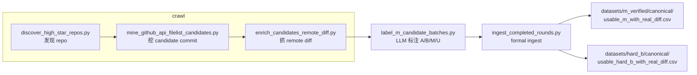

# 2026-05-27 M 与 hard_b 爬取标准及当前运行口径

这份记录用于固定当前仓库内 `M` 与 `hard_b` 两条数据链路的正式筛选标准、当前有效运行方式，以及截至 `2026-05-31` 的最新状态。

## 0. 标签含义与最小流程

当前仓库里的 commit 标签含义与 `label_m_candidate_batches.py` 中的标注 prompt 保持一致：

- `A`：单意图，且相对聚焦 / 较窄。
- `B`：单意图，但实现范围更宽 / 更复杂。
- `M`：一个 commit 中包含两个及以上相互独立的意图 / 目的。
- `U`：基于当前 message + diff 证据仍然无法稳定判断。

最小流程：

这里需要明确：

- `crawl` 只负责抓 repo / commit / diff 原始证据。
- `label` 负责把 commit 判成 `A/B/M/U`。
- `ingest` 负责把新标签并回 formal canonical。

## 1. 当前有效状态

截至 `2026-05-31`，当前 live 状态是：

- `datasets/m_verified/canonical/usable_m_with_real_diff.csv = 2142` 条，覆盖 `1193` 个 repo
- `datasets/hard_b/canonical/usable_hard_b_with_real_diff.csv = 483` 条，覆盖 `362` 个 repo
- `archive/datasets/m_verified/workspace/label_snapshots/gitlog_all_pilot_labels_combined.csv = 10512` 条，覆盖 `2266` 个 repo
- `datasets/hard_b/manifest/usable_hard_b_with_real_diff_manifest.json`
  中记录：
  - `candidate_b_rows = 5588`
  - `usable_real_diff_count = 483`
  - `need_full_diff_rows = 0`
  - `m_positive_pool_count = 2142`
- `archive/datasets/m_verified/workspace/crawl_state_relaxed/original_batch_m_crawl_state.json`
  中记录：
  - `last_completed_round = batchcrawl_20260531T112341Z_round0117`
  - `current_campaign = null`
  - `current_round = null`

当前最重要的运行口径变化：

- `M` 的 discovery 已改为更宽的自动 query 集，不再继续重启旧的单一 query 方案。
- `hard_b` recovery 当前默认是按需运行，不再把常驻 daemon 作为默认操作方式。
- 当前这一轮 label / ingest 已确认使用 DeepSeek 接口跑通，正式可用。

### 1.1 当前字段口径

后续看到这些数字时，统一按下面理解：

- `combined labels`：联合标签库总行数，表示当前已经汇总到 `gitlog_all_pilot_labels_combined.csv` 的全部样本数。
- `M` / `m_positive_pool_count`：正式 `M` 正例池规模，指已经满足 `llm_label == M` 且拥有真实 `diff --git` 的样本数。
- `hard_b usable_real_diff_count`：正式 `hard_b` 池规模，指已经满足 `llm_label == B`、不与 `M` 重叠、且拥有真实 `diff --git` 的样本数。
- `candidate_b_rows`：`hard_b` 上游候选库中的 `B` 类候选总数，未必全部进入正式池。
- `need_full_diff_rows`：`hard_b` 侧仍需要补完整 diff 的候选数；为 `0` 时表示 backlog 已清空。

## 2. M 当前标准

### 2.1 repo 发现标准

当前 `M` 批跑入口是：

- `datasets/m_verified/tooling/scripts/run_original_batch_m_crawl.py`

repo 发现阶段调用：

- `datasets/m_verified/tooling/scripts/discover_high_star_repos.py`

当前 discovery 仍然保持高精度前提：

- 只扫高 star GitHub repo
- `fork:false`
- `archived:false`
- 默认排除已见过 repo
- 以 code-like repo 为主

但当前已经不再局限于最早那套较窄的 query。新的自动 relaxed discovery 已扩展为更宽的语言 / topic / 工作流桶，用来继续从剩余搜索空间中找新增 repo。

### 2.2 候选 commit 挖掘标准

候选挖掘脚本：

- `datasets/m_verified/tooling/scripts/mine_github_api_filelist_candidates.py`

当前仍保留偏保守的候选门槛：

- 依赖 commit subject / message 中的显式多动作信号
- 明显降权 `merge`、`revert`、`release`、`deps`、`typo`、纯 formatting
- `min-base-score` 仍是上游重要过滤器

这意味着：

- `M` 不是简单放宽阈值来扩池；
- 当前策略更偏向先扩大 repo 发现面，再维持 formal gate 不变。

### 2.3 正式入池标准

最终正式 `M` 数据构建脚本：

- `datasets/m_verified/tooling/scripts/build_usable_m_diff_dataset.py`

正式入池规则是：

- `llm_label == M`
- `git_diff` 必须包含真实 `diff --git`
- fallback diff 不算
- 没有真实 diff 的样本不进入 canonical

当前正式资产：

- `datasets/m_verified/canonical/usable_m_with_real_diff.csv`

当前规模：

- `2142` 条

### 2.4 M 的具体用途

`M` 在当前仓库中的用途是：

- 作为 Step2 verified multi-intent few-shot 的正式上游来源
- 作为多意图真实正例池
- 作为后续多意图模式分析与审计的正式资产

## 3. M 当前速度判断

当前 `M` 新增速度的正确判断是：

- 严格门槛仍会压召回；
- 但主要问题已经不再是“继续重启同一套旧 query”；
- 更关键的是 discovery 要持续换新的搜索口径。

这也是为什么本轮直接修改了 discovery 策略，而不是继续重复拉起旧配置。

`2026-05-31` 新起的 discovery campaign：

- `batchcrawl_20260531T112341Z`
- `repo_count = 1`
- 新 repo 为 `vitest-dev/vitest`
- 产出 `round0117`
- `candidate_rows = 2`
- `diff_ok = 2`

这说明新 discovery 口径已经可以继续产生新增，只是当前新增规模较小，属于“低产出但仍有新料”的阶段。

## 4. hard_b 当前标准

`hard_b` 当前不是发现新 repo 的独立 crawler，而是从已有标签库存里构建严格的复杂单意图负例池。

核心脚本：

- `datasets/hard_b/tooling/scripts/build_hard_b_pool.py`

### 4.1 标签与排除标准

第一层硬门槛：

- `llm_label == B`
- 不与 `M` 正池 `(repo, sha)` 重叠

第二层排除规则会过滤掉：

- `merge`
- `revert`
- `release`
- `format-only`
- `vendor/generated`
- `lockfile-only`
- 太小的提交
- 高不确定性样本
- blocklist repo

### 4.2 复杂度标准

`hard_b` 不是“所有 B 都收”，而是要求：

- 单目标
- 复杂度足够高
- 必须有真实 `diff --git`

没有 real diff 的复杂 `B` 样本，只会进入待补 diff 列表，不会直接进入 formal canonical。

### 4.3 当前正式规模

当前 manifest 显示：

- `candidate_b_rows = 5588`
- `usable_real_diff_count = 483`
- `repo_count = 362`
- `need_full_diff_rows = 0`

正式资产：

- `datasets/hard_b/canonical/usable_hard_b_with_real_diff.csv`

### 4.4 hard_b 的当前运行方式

当前有效运行方式是：

- 默认按需执行 `build_hard_b_pool.py`
- 只有在上游 `M` / combined labels 新增后，才需要重新构建 backlog
- 当前 backlog 为 `0`，因此没有必要常驻跑 recovery

这和早先的“continuous hard_b recovery”设计稿不同。当前仓库实际运行口径应统一表述为：

- `hard_b` recovery 默认 one-shot / on-demand
- 只有显式传 `--daemon` 时才持续轮询

### 4.5 hard_b 的具体用途

`hard_b` 在当前仓库中的用途是：

- 作为复杂单目标 hard negative 正式池
- 用于 `M` / `B` 边界分析
- 用于 Step3 或后续负例控制与再复核

它不是 Step2 verified multi-intent 正例来源。

## 5. 当前 label / ingest 口径

这部分口径已经更新，不能再沿用旧的 `.llm_api_key + OpenAI` 叙事。

当前已验证跑通的 label 配置是：

- endpoint：`https://api.deepseek.com/chat/completions`
- model：`deepseek-v4-flash`
- key 来源：`DEEPSEEK_EXPERIMENT_API_KEY`

当前统一 ingest 入口：

- `datasets/m_verified/tooling/scripts/ingest_completed_rounds.py`

其职责是：

- 对新 remote diff rows 做补标
- 合并到 combined labels
- 重建 `M` canonical
- 同步重建 `hard_b`

## 6. 2026-05-31 新实验记录摘要

本轮已经完成以下实际运行：

1. `round0114`
   - 新写入 labels：`51`
   - combined：`10354 -> 10405`
   - `hard_b usable_real_diff_count: 426 -> 442`

2. `round0115 + round0116`
   - 新写入 labels：`105`
   - combined：`10405 -> 10510`
   - `m_positive_pool_count: 2130 -> 2141`
   - `hard_b usable_real_diff_count: 442 -> 483`

3. 新 discovery campaign `batchcrawl_20260531T112341Z`
   - `repo_count = 1`
   - 产出 `round0117`
   - 新写入 labels：`2`
   - combined：`10510 -> 10512`
   - `m_positive_pool_count: 2141 -> 2142`
   - `hard_b usable_real_diff_count` 保持 `483`

当前最终状态：

- `M = 2142`
- `hard_b = 483`
- combined labels `= 10512`
- `hard_b need_full_diff_rows = 0`
- `M` 没有 active campaign

详细过程见：

- `docs/records/2026-05-31-m-hard-b-round0114-0117-ingest-and-discovery-update.md`

## 7. 当前推荐理解

当前最准确的项目判断是：

- `M` 的正式 gate 仍然严格；
- 如果要继续扩 `M`，优先改 discovery 面，而不是反复重启旧 query；
- `hard_b` 的质量门槛仍然严格；
- `hard_b` 当前不是靠常驻 recovery 维持增长，而是依赖新的 label / ingest 之后按需重建；
- 当前 label / ingest 链路已通过 DeepSeek 配置跑通，不再处于“等待 key / 账户可用性”的旧状态。
