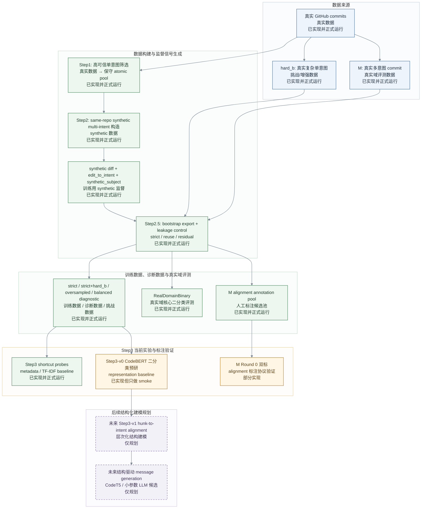

> 状态：已归档 / 过时
> 本文档是历史实现说明，可能不反映当前代码状态。
> 当前事实来源：docs/CURRENT_STATUS.md

# 项目实现现状

本文使用的事实依据按优先级排序如下：

1. 真实代码行为：`code/step1/`、`code/step2/`、`code/step3/`
2. 最新完整正式产物：
   - Step1 当前 source pool：`datasets/derived/step1_source_pool/current/`
   - Step1 对应正式 run：`datasets/derived/step1_runs/step1_formal_step2_sha_expanded_annotated_disjoint_p3000_20260527T071833Z/`
   - Step2 正式 fullscale：`code/step2/outputs/step2_fullscale_formal_proxyclean_20260530T030311Z/aggregate/`
   - Step2.5 / Step3 协议正式根目录：`outputs/step3_balanced_diagnostic_readiness_20260604T014128Z/`
   - Step3-v0 CodeBERT exploratory smoke：`outputs/step3_codebert_exploratory_20260604T065533Z/`
3. README 和已有 docs 仅作为辅助，不作为唯一事实来源。

当前项目的最新阶段是：**Step3-v0 exploratory intent-count classifier**。它是一个最小、受控的二分类预研，用来验证表示学习是否能稳定超过 metadata / TF-IDF baseline。

## 1. 项目目标与核心问题

项目要解决的问题，不是普通的 commit message 生成，而是**复杂 commit 的结构理解**。对于一个真实 commit，我们希望最终能够判断：

- 这个 commit 是单意图、复杂单意图，还是多意图；
- 如果是多意图，它内部包含多少个潜在意图；
- 每个 diff hunk 更可能属于哪个意图；
- 这些结构信息如何为后续更可信的 commit message generation 提供依据。

项目实际上可以理解为三级任务：

1. **第一级：单意图 / 多意图判别**  
   先回答一个 commit 是不是多目的。这是当前 Step3-v0 正在做的最小问题。

2. **第二级：多意图个数判别**  
   如果确认是多目的，进一步判断它到底包含几个潜在意图，而不只是粗分成“多”。

3. **第三级：多意图内容分解与摘要生成**  
   把每个意图分别识别出来，判断各个 hunk 属于哪个意图，并能为每个意图写出局部摘要，最终支持更结构化的 commit message 生成。

当前的进度到 **Step3-v0 exploratory intent-count classifier**：输入 `message / diff / message+diff`，输出 `k=1` 或 `k>=2`。未来完整 Step3 需要的 hunk-to-intent alignment、slot/set decomposition、结构驱动 message generation，目前都还没有完成。

## 2. 项目整体流程

## 3. Step1：高可信单意图 source 筛选

### 3.1 目标

Step1 的目标，是从真实 commit 中筛出一批**高可信单意图**样本，作为 Step2 synthetic 构造的原料。之所以要先做这一步，是因为不能把全部真实 commit 都默认当成 atomic source。真实仓库里的 commit 很多本来就是复杂单意图或多意图，如果直接把它们当作“单意图原子单位”，后续 synthetic multi-intent 的标签就会被污染。

Step1 的本质，是在真实数据上建立一个保守 source pool，而不是直接解决最终任务。它给 Step2 提供的是“尽可能干净的拼装原料”，而不是最终论文模型。

### 3.2 输入

Step1 当前对外输出的正式字段集合如下：

| 字段 | 含义 | 备注 |
|---|---|---|
| `repo` | 仓库标识 | Step2 same-repo grouping 的基础键 |
| `sha` | commit SHA | source 唯一标识 |
| `type` | commit 类型 | 当前主要为 `feat/fix/refactor/test/perf` |
| `subject` | commit subject | 后续 few-shot 和 message 流程的重要输入 |
| `message` | commit message 文本 | 与 subject 语义接近，但仍单独保留 |
| `git_diff` | 完整 diff 文本 | full-diff 特征与 Step2 合成原料 |
| `source_confidence` | 最终 source 置信度 | 当前公式见 metadata：`calibrated_model_prob * rule_weight` |
| `model_prob` | full-diff 模型概率 | Step1 模型输出 |
| `rule_weight` | 规则权重 | 保守 refilter 参与项 |
| `rule_label` | 规则侧标签 | 规则基线输出 |
| `conservative_tier` | 保守分层 | 当前正式主池以 Tier-A 为主 |
| `model_tier` | 模型分层 | full-diff 模型打分对应分层 |
| `selection_strategy` | 选源策略 | 当前为 `model_rule_refilter` |
| `selection_reason` | 入池原因 | 用于审计与解释 |
| `passed_rule_refilter` | 是否通过 rule refilter | 当前正式主池中应为真 |
| `tau_a` / `tau_b` | 当前阈值快照 | 便于复现实验设置 |
| `commit_url` | commit URL | 后续 hard guard 与追溯字段 |

来源：`datasets/derived/step1_source_pool/current/conservative_atomic_sources.csv`

### 3.3 处理流程

Step1 当前真实处理链路可以概括为：候选池构建 → 弱标签协议 → rule-only baseline → full-diff feature model → probability calibration → Tier-A / Tier-B / Tier-C → 人工审计 → proxy-gap analysis。

| 模块 | 输入 | 核心处理 | 输出 | 当前状态 | 对应代码 |
|---|---|---|---|---|---|
| 候选池构建 | 原始 commit 候选与协议 split | 按 protocol/calibration/evaluation 划分候选集 | `annotated_splits/*.csv` | 已实现并正式运行 | `code/step1/src/data_splitting/annotated_split_protocol.py` |
| rule-only baseline | 候选 commit | 基于规则的单意图粗筛 | rule-only candidate scores / selected candidates | 已实现并正式运行 | `code/step1/src/pipeline/selection.py` |
| full-diff feature model | 含完整 diff 的候选 commit | 训练/打分 full-diff GBDT 风格模型并做概率校准 | `atomic_calibration_full_diff.json` | 已实现并正式运行 | `code/step1/src/pipeline/full_diff_calibration.py` |
| message-only proxy | 仅 message / subject 的候选 commit | 建立 message-only 代理打分，用于粗筛和 proxy-gap 比较 | `message_only_calibration.json` | 已实现并正式运行 | `code/step1/src/pipeline/message_only_calibration.py` |
| strategy compare | rule-only / model-only / model+rule | 比较不同选源策略的保守性和 audit precision | `strategy_comparison.json` | 已实现并正式运行 | `code/step1/src/analysis/strategy_compare.py` |
| Tier 分层与保守 source pool | 校准后的分数和规则权重 | 用 `tau_a`/`tau_b` 和 rule refilter 形成 Tier-A 主池 | `conservative_atomic_sources.csv` | 已实现并正式运行 | `code/step1/src/pipeline/selection.py` |
| enrich | 被选中的 source | 解析 repo、补全 commit text / diff 缓存 | `enriched/resolved_candidates.csv` | 已实现并正式运行 | `code/step1/src/pipeline/enrich.py` |
| audit / validation | Tier-A / Tier-B 样本 | 抽样审计与误分模式分析 | `audit_precision_report.json` | 已实现并正式运行 | `code/step1/src/pipeline/validation.py` |
| proxy-gap analysis | message-only 与 full-diff 输出 | 衡量 proxy 与真实 full-diff 判断的偏差 | `proxy_gap_analysis.json` | 已实现并正式运行 | `code/step1/src/analysis/proxy_gap_report.py` |

概念说明：

第一，**message-only proxy** 的角色不是最终分类器，而是粗筛代理。它可以在“还没有完整 diff”或“需要快速收窄候选池”时提供便宜的先验，但不负责最终 source pool 的可信度。

第二，**full-diff model** 是 Step1 当前真正负责正式筛选的模型化部分。当前 source pool metadata 明确写了：

- `selection_strategy = model_rule_refilter`
- `source_confidence_formula = calibrated_model_prob * rule_weight`
- `tau_a = 0.94732`
- `tau_b = 0.834592`

来源：`datasets/derived/step1_source_pool/current/source_pool_metadata.json`

第三，**Tier-A** 在当前实现里对应保守主池。进入 Step2 的并不是所有模型高分样本，而是经过 **rule refilter** 之后的保守集合。

### 3.4 输出

Step1 当前给 Step2 的正式输出主要有三类。

第一类是**正式 source pool**：

- `datasets/derived/step1_source_pool/current/conservative_atomic_sources.csv`
- 当前正式数量：`5099`
- 来源：`datasets/derived/step1_source_pool/current/source_pool_metadata.json`

第二类是**审计与校准结果**：

- `datasets/derived/step1_source_pool/current/audit_precision_report.json`
- `datasets/derived/step1_source_pool/current/strategy_comparison.json`
- `datasets/derived/step1_source_pool/current/proxy_gap_analysis.json`

第三类是**Step1→Step2 bridge**：

- `datasets/derived/step2_bridge/current/step2_source_candidates_from_step1.csv`
- `datasets/derived/step2_bridge/current/step2_source_candidates_from_step1_manifest.json`

当前真正进入 Step2 的 source 是 `5099` 条，repo 数 `82`，类型分布为 `feat/fix/refactor/test/perf` 的保守子集。来源：`datasets/derived/step2_bridge/current/step2_source_candidates_from_step1_manifest.json`

bridge CSV 的实际表头与 current source pool 高度对齐，说明 Step1 到 Step2 之间没有再做 schema 改写，尽量保留 provenance：

| 字段 | 含义 |
|---|---|
| `repo`, `sha`, `type`, `subject`, `message`, `git_diff` | Step2 pair construction 的基本输入 |
| `manual_label` | Step1 侧的人工协议标签/分层信息 |
| `source_confidence`, `model_prob`, `rule_weight` | 后续权重和样本审计的可追溯信息 |
| `selection_strategy`, `selection_reason` | 选源策略与入池原因 |
| `conservative_tier`, `model_tier` | Step1 保守分层与模型分层 |
| `tau_a`, `tau_b` | 当前阈值快照 |
| `rule_label`, `passed_rule_refilter` | 规则侧筛选痕迹 |
| `commit_url` | 后续 hard guard / 追溯字段 |

来源：`datasets/derived/step2_bridge/current/step2_source_candidates_from_step1.csv`

## 4. Step2：synthetic multi-intent 构造

### 4.1 目标

Step2 的目标，是把 Step1 提供的高可信单意图 source，在同 repo 约束下组合成 synthetic multi-intent commit。这样做的最大好处，是 synthetic 样本天然拥有：

- `synthetic_diff`
- `edit_units`
- `edit_to_intent`
- `intent_types`
- `intent_subjects`

也就是说，后续模型训练时最难得到的局部结构标签，可以在构造阶段直接保留下来。

当前正式 fullscale 产物来自 `code/step2/code/construct_simple_two_intent.py`，因此当前正式样本的主干是 `intent_k = 2`。

synthetic 数解决的是“如何得到结构标签”，不是“如何完全拟真”。因此 synthetic 数据永远只能作为训练和诊断手段，不能替代真实域评测。

### 4.2 输入

Step2 的主输入来自 Step1 的保守 atomic source pool，经由 bridge 映射进入：

- `datasets/derived/step2_bridge/current/step2_source_candidates_from_step1.csv`

这一层的关键字段包括：

- `repo`
- `sha`
- `type`
- `subject`
- `message`
- `git_diff`
- `source_confidence`
- `manual_label`

`hard_b` 和 `M` 不属于 Step2 的普通 synthetic source。它们是在 Step2.5 之后接入的真实域资产，用于挑战集、真实域 benchmark 和后续诊断，不参与 Step2 的 synthetic pair construction。

从 bridge CSV 的真实字段看，Step2 当前接收到的输入可以按三类理解：

| 字段组 | 具体字段 | 作用 |
|---|---|---|
| 识别字段 | `repo`, `sha`, `commit_url` | 同 repo 分组、source 唯一标识、追溯 |
| 语义输入 | `type`, `subject`, `message`, `git_diff` | pair construction、few-shot 查询、LLM subject 生成、diff materialization |
| 置信与审计 | `source_confidence`, `model_prob`, `rule_weight`, `rule_label`, `selection_strategy`, `selection_reason`, `conservative_tier`, `model_tier`, `tau_a`, `tau_b`, `passed_rule_refilter`, `manual_label` | 质量追溯、样本权重、debug |

其中 `construct_simple_two_intent.py` 当前仍保留对 `manual_label="A"` 的 formal-run 兼容检查；bridge CSV 的真实主文本列则是 `message`，不是 `commit_message`。

### 4.3 真实处理链路

当前正式主线的真实执行顺序，来自 `code/step2/code/construct_simple_two_intent.py` 及其相关函数：

source loading → same-repo grouping → candidate pair enumeration → all-pairs precheck → synthetic diff materialization → `edit_units` → `edit_to_intent` → few-shot retrieval → LLM `synthetic_subject` generation → message scoring → `pass / fallback / reject` → Step3-ready export。

| 阶段 | 输入 | 核心规则 | 输出 | 失败处理 | 对应代码 |
|---|---|---|---|---|---|
| source loading | Step1 bridge CSV | 只加载允许的 source 类型与 current source pool | in-memory source universe | 缺字段直接阻断 | `code/step2/code/construct_simple_two_intent.py` |
| same-repo grouping | source universe | 只在同 repo 内组合 | repo 内候选 pair | 不跨 repo | 同上 |
| candidate pair enumeration | 同 repo source | 当前正式主线只做 `intent_k=2` | candidate pairs | 不生成更高 k | 同上 |
| all-pairs precheck | pair + messages + diff 特征 | merge/semantic/type/relation/message 信息 gate | `pass / warn / skip` | `skip` 不进入生成 | 同上 |
| synthetic diff materialization | precheck pass/warn 的 pairs | 合并 diff，并保留来源映射 | `synthetic_diff`, `edit_units` | materialization 失败则样本失败 | 同上 |
| few-shot retrieval | pair 类型签名、repo、k | 从 few-shot DB 检索结构相似例子 | few-shot context | 检索失败可继续，但会影响生成 | `code/step2/code/retrieve_fewshot.py` 与主脚本调用 |
| LLM synthetic subject generation | pair + diff evidence + few-shot | 用 LLM 融合生成单句 subject，而不是机械拼接 | `synthetic_subject` | 可能 `generation_failed` | `construct_simple_two_intent.py` |
| message scoring | LLM subject + source evidence | coverage/faithfulness/format/style/artifact 评分 | `message_scores`, `message_status` | `reject` 不进 step3_ready | 同上 |
| step3_ready export | 所有样本 | 仅 `pass + fallback` 进入正式训练池 | `synthetic_samples_step3_ready.jsonl` | `skip`、`reject` 分流到 sidecar / rejected | 同上 |

这里最容易混淆的几类失败，需要明确分开：

- `precheck skip`：构造前就被挡掉，不尝试生成；
- `generation_failed`：通过 precheck，但 LLM 生成阶段失败；
- `message reject`：生成成功，但质量 gate 不过；
- `message fallback`：生成可用，但质量不够强，需要降权而非直接丢弃；
- `message pass`：生成和评分都满足较强条件。

### 4.4 synthetic subject 生成

Step2 不是直接把两个原始 message 串起来，而是显式做 LLM 融合改写。原因很简单：简单拼接虽然便宜，但会造成非常强的机械信号，模型后续很容易学到“这是两句并列拼起来的”，而不是更自然的多意图表达。

few-shot 的作用，是给 LLM 提供**同类型签名、同 `k`、风格清洁**的参考例子，而不是提供标签本身。当前 few-shot 检索后端来自 `datasets/step2/delivery/current/fewshot_pool.db`，默认由 `construct_simple_two_intent.py` 调用。

message quality gate 当前真实检查的核心维度包括：

- `format`
- `coverage`
- `faithfulness`
- `artifact_score`
- `relevance_score`
- `style_score`
- 合成后的 `message_quality_weight`

当前这套 gate 里，`format`、coverage/faithfulness 不足、明显 artifact 等会直接影响 `message_status`；而 `message_quality_weight` 不只是是否保留，也会影响样本最终权重。

Step2 目前采用的正式生成模型配置，在代码常量里是：

- `generator_model = deepseek-v4-pro`
- `generator_thinking_type = disabled`
- `max_output_tokens = 128`

来源：`code/step2/code/construct_simple_two_intent.py`

### 4.5 difficulty 与 realism

Step2 当前确实已经把 difficulty / realism 写入 metadata，但必须区分“字段已存在”和“复杂 realism 逻辑已经形成正式监督”这两件事。

当前代码 `code/step2/code/difficulty_realism.py` 已经实现了：

- `difficulty_level` / `difficulty_name`
- `difficulty_features`
- `training_focus`
- `realism_features`
- `realism_score`
- `rho`
- `realism_weight_config`

difficulty 的级别定义当前代码中明确为：

- A：single-intent simple
- B：single-intent complex
- C：multi-intent separable
- D：multi-intent entangled

但当前正式 fullscale 的主线样本，来自 `construct_simple_two_intent.py`，且样本内容显示：

- `intent_k = 2`
- `difficulty_level = C`
- `structure_pattern = separable`
- `shared_file_count = 0`
- `rho = 1.0`

这说明 difficulty / realism 元数据已经写入，但**当前正式 fullscale 实际上还是以 `k=2 separable` 为主**，复杂 entangled 和非平凡 realism 分布还没有成为正式监督主干。支撑证据可直接在 `code/step2/outputs/step2_fullscale_formal_proxyclean_20260530T030311Z/aggregate/synthetic_samples_step3_ready.jsonl` 中看到，样本字段普遍为上述状态。

### 4.6 输出与 fullscale 结果

Step2 正式 fullscale 聚合输出位于：

- `code/step2/outputs/step2_fullscale_formal_proxyclean_20260530T030311Z/aggregate/synthetic_samples.jsonl`
- `code/step2/outputs/step2_fullscale_formal_proxyclean_20260530T030311Z/aggregate/synthetic_samples_step3_ready.jsonl`
- `code/step2/outputs/step2_fullscale_formal_proxyclean_20260530T030311Z/aggregate/synthetic_samples_precheck_rejected.jsonl`
- `code/step2/outputs/step2_fullscale_formal_proxyclean_20260530T030311Z/aggregate/fullscale_summary.json`

当前最可信的 fullscale 数字如下：

- source pool size：`5099`
- selected pairs：`27901`
- primary source coverage：`4658`
- uncovered source：`441`
- generated merged count：`27901`
- step3_ready count：`19137`
- precheck rejected count：`1207`
- step3_ready / generated 比例：`0.685889`

来源：`code/step2/outputs/step2_fullscale_formal_proxyclean_20260530T030311Z/aggregate/fullscale_summary.json`

按样本状态进一步拆分，当前正式 fullscale 还可以总结为：

- `generation: generated = 25900`
- `generation: generation_failed = 794`
- `generation: not_attempted_precheck_skip = 1207`
- `message: pass = 7542`
- `message: fallback = 11595`
- `message: reject = 6763`

这意味着当前进入 Step3-ready 正式训练池的，是 `pass + fallback = 19137` 条；`message reject = 6763` 是已生成但不进入主训练池的样本；`precheck skip = 1207` 是构造前即被挡住的组合。

Step2 输出字段（synthetic_samples_step3_ready.jsonl）：

| 字段层 | 代表字段 | 含义 |
|---|---|---|
| 样本主键与构造信息 | `sample_id`, `repo`, `construction_type`, `construction_route`, `intent_count`, `intent_k` | 标识 synthetic 样本及其构造方式 |
| source 组合信息 | `sources`, `source_types_raw`, `source_types_canonical`, `type_pair`, `different_type`, `module_overlap` | 样本由哪些 atomic source 构成，以及它们的关系 |
| diff 规模信息 | `merged_file_count`, `merged_changed_lines`, `merged_hunk_count`, `synthetic_diff` | 合成后的 diff 规模和文本 |
| 结构监督 | `edit_units`, `edit_to_intent`, `intent_hunk_counts`, `block_intent_sequence`, `block_switches` | Step3 直接可用的结构标签 |
| 局部意图语义 | `intent_types`, `intent_messages`, `intent_subjects`, `intent_diff_evidence_cards` | 每个局部 intent 的语义和 diff 证据 |
| precheck 结果 | `precheck_status`, `precheck_skip_reason`, `precheck_warning_reasons`, `pair_quality_weight`, `precheck_scores`, `precheck_meta` | 构造前相容性与质量检查 |
| LLM 生成信息 | `synthetic_subject`, `generation_status`, `few_shot_source`, `few_shot_retrieval_log`, `message_meta` | synthetic subject 的生成过程 |
| message gate 结果 | `message_status`, `message_scores` | `pass/fallback/reject` 与对应质量评分 |
| difficulty / realism | `difficulty_level`, `difficulty_name`, `difficulty_features`, `structure_pattern`, `realism_features`, `realism_score`, `rho`, `realism_weight_config` | 难度与拟真度元数据 |
| 综合权重 | `sample_confidence`, `pair_quality_weight`, `final_sample_weight` | 后续 Step2.5 / Step3 使用的样本权重基础 |

如果只从 Step3 训练角度看，当前 Step2 输出中最关键的四组字段是：

1. `synthetic_diff`
2. `edit_units` / `edit_to_intent`
3. `synthetic_subject`
4. `message_status` + `final_sample_weight`

这四组字段共同决定了样本既能提供结构监督，又能被质量 gate 和后续 exporter 正确过滤。

### 4.7 当前限制

当前 Step2 还存在几个明确边界，必须和已经实现的部分分开写。

已经正式实现的：

- same-repo grouping
- `k=2` synthetic construction
- all-pairs precheck
- synthetic diff materialization
- `edit_units` / `edit_to_intent`
- few-shot retrieval
- LLM synthetic subject generation
- message scoring / pass-fallback-reject
- difficulty / realism metadata 写入

尚未真正形成正式监督主干或仍然缺失的：

- 作者一致性约束：未形成正式 hard constraint
- 时间窗口约束：未形成正式 hard constraint
- 真实 `git apply` / merge 校验：precheck 中仍以 `git_check_method = not_available` 为主
- shared-file entangled 正式数据：没有形成大规模正式主池
- `k >= 3` 正式主线：当前未建立
- 非平凡 `omega_src`：当前 source confidence 传递还有限
- 非平凡 `rho` / realism discriminator：字段存在，但当前 fullscale 主体仍然近似常量

## 5. Step2.5：Bootstrap Export 与泄漏控制

### 5.1 为什么需要单独做 exporter

如果不单独做 Step2.5 exporter，而是简单地把 Step1 atomic 和 Step2 synthetic 样本随机切分，模型会很容易学到 shortcut。最典型的情况是：某个 source commit 先以 `k=1` 形式出现在训练集中，随后又作为 `k=2` synthetic 的组成部分出现在测试集中。此时模型不需要理解“为什么这个 hunk 属于哪个意图”，只需要记住那段 diff 就可以。

此外，即使没有跨 train/test 泄漏，如果把**未被选中参与 k=2 的剩余 source**直接拿来做 `k=1`，也可能造成 selection residue shortcut：模型学到的不是单意图与多意图的结构差异，而是“被选进 pair construction 的 source”和“没被选进 pair construction 的 source”之间的表层差异。

因此 Step2.5 的角色是做严格的 source-level leakage control 和诊断型数据变体构建。

### 5.2 输入

当前 Step2.5 exporter 的正式代码入口是 `code/step2/code/export_step3_bootstrap_dataset.py`。它的输入有四类：

- Step1 atomic source universe：`datasets/derived/step1_source_pool/current/conservative_atomic_sources.csv`
- Step2 Step3-ready synthetic：`code/step2/outputs/step2_fullscale_formal_proxyclean_20260530T030311Z/aggregate/synthetic_samples_step3_ready.jsonl`
- `hard_b` 真实复杂单意图资产
- `M` 真实多意图资产

这四类输入不会进入同一个出口。Step1 + Step2 构成 synthetic training/eval universe；`hard_b` 和 `M` 则分别进入挑战集、真实域评测和 annotation pool。

字段层面，Step2.5 的输入实际上是三种不同 schema 的汇合：

| 输入源 | 代表文件 | 关键字段 |
|---|---|---|
| Step1 atomic source universe | `datasets/derived/step1_source_pool/current/conservative_atomic_sources.csv` | `repo`, `sha`, `type`, `subject`, `message`, `git_diff`, `source_confidence`, `model_prob`, `rule_weight`, `commit_url` |
| Step2 step3-ready synthetic | `code/step2/outputs/step2_fullscale_formal_proxyclean_20260530T030311Z/aggregate/synthetic_samples_step3_ready.jsonl` | `sample_id`, `repo`, `sources`, `synthetic_diff`, `edit_units`, `edit_to_intent`, `synthetic_subject`, `message_status`, `difficulty_level`, `rho`, `final_sample_weight` |
| 真实域资产 | `hard_b` / `M` manifest 与 CSV | `repo`, `sha`, `subject`, `message`, `git_diff`, commit-level 复杂度与真实域标签字段 |

这也是为什么 Step2.5 不能只是一个“把文件拷出来”的脚本：它是在不同 schema 之间建立统一、可审计、可防泄漏的训练/评测出口。

### 5.3 三种数据变体

Step2.5 当前正式实现了三种核心导出变体：

- `strict`：论文主数据。`k=1` 只能来自 `atomic_only`，`k=2` 只能来自 `composite_only`，同一 split 内也做 source-role disjoint。
- `reuse_ablation`：允许 source 在同一 split 内复用，用于诊断 memorization shortcut。
- `residual_k1_ablation`：把剩余 source 作为 `k=1`，用于诊断 selection residue shortcut。

这三种导出模式在代码中是显式支持的，而不是靠命名约定。来源：`code/step2/code/export_step3_bootstrap_dataset.py`

### 5.4 hard guard 与 soft guard

当前 Step2.5 里，hard guard 与 soft guard 已经被代码层面区分。

hard guard 用于表示**明确不能跨 split** 的关系，当前包括：

- exact normalized subject duplicate
- exact commit URL
- repo alias canonicalization
- exact normalized diff fingerprint（当前还带 same repo 与 path-set compatible 限制）

soft guard 用于表示“比较相似，但未必应该强行绑死在同一 split”的关系。当前 soft guard 已经从早期的连通分量式硬约束，改成了**penalty-only** 机制：它不再默认形成必须同 split 的 connected component，而是在 split assignment 时作为优化目标中的惩罚项。

这次改动的重要意义在于：soft similarity 不再自动造成巨大 guard group，从而减少“因为 single-linkage chaining 导致 split collapse”的风险。

### 5.5 最新结果

当前 Step2.5 / Step3 协议的正式根目录为：

- `outputs/step3_balanced_diagnostic_readiness_20260604T014128Z/`

`strict` 当前正式计数是：

- `k1 = 713`
- `k2_positive = 1800`
- `negative_precheck = 89`
- `negative_message = 90`
- hard leakage gate = `passed`

来源：`outputs/step3_balanced_diagnostic_readiness_20260604T014128Z/strict/step3_bootstrap_manifest.json` 与同目录 `step3_bootstrap_leakage_report.json`

policy sweep 当前已经完整跑完：

- `completed_policy_count = 36`
- `failed_policy_count = 0`
- `primary_usable_count = 36`
- `sweep_complete = true`

来源：`outputs/step3_balanced_diagnostic_readiness_20260604T014128Z/policy_sweep/policy_sweep_results.json`

soft penalty 在 canonical strict 上的语义，需要特别解释。当前 `strict/soft_penalty_effectiveness_report.json` 显示：

- `soft_edge_count_total = 26`
- `random_baseline_cross_split_soft_edge_weight = 0.0`
- `greedy_initial_cross_split_soft_edge_weight = 0.0`
- `optimized_cross_split_soft_edge_weight = 0.0`
- `semantics_status = repo_split_already_zero_penalty`

这不是“soft penalty 失效”，而是说明：**在 canonical strict 这个具体 split 上，repo / hard-group 约束已经天然把跨 split soft-edge 惩罚压到了 0**。但在 sweep 的其他 policy 中，optimizer 是真实有效的。例如 `subj_0_3333_diff_0_1270_dist_0_1500_cap_100_reuse_3` 这个 policy 的 soft penalty 路径能把 cross-split soft-edge weight 从 `95.394384` 降到 `9.589969`。来源：同目录 `policy_sweep/.../strict/soft_penalty_effectiveness_report.json`

因此，目前已经解决的问题有：

- hard leakage gate 已经稳定通过；
- strict/reuse/residual 语义清晰；
- split collapse 在 policy sweep 层面已解决；
- soft penalty 已从理论设想变成真实实现。

仍然不能过度解读的部分有：

- soft penalty 目前更像**安全与 split 稳定性的工程机制**，不能当作论文主贡献；
- canonical strict 上 soft penalty 目前主要是语义审计，并非主增益来源；
- 当前最大的正式数据利用率损失，仍然来自 guard group 结构和 reuse cap，而不是 role partition 本身。`repo_guard_group_audit.json` 显示：
  - `largest_guard_group_size = 1265`
  - `pairs_dropped_by_role_partition = 121`
  - `pairs_dropped_by_reuse_cap = 43776`

来源：`outputs/step3_balanced_diagnostic_readiness_20260604T014128Z/audit_strict/repo_guard_group_audit.json`

从 Step2.5 的真实导出行结构看，当前 exporter 已经把不同来源样本统一到接近同构的 JSONL schema，只在真实域字段上做少量扩展：

| 导出类型 | 代表文件 | 关键字段 |
|---|---|---|
| strict train row | `strict/step3_bootstrap_train.jsonl` | `schema_version`, `sample_uid`, `repo`, `split`, `export_mode`, `origin_kind`, `origin_id`, `construction_route`, `k`, `source_shas`, `source_roles`, `family_id`, `source_component_id`, `sources`, `hunks`, `edit_to_intent`, `intent_types`, `intent_subjects`, `intent_messages`, `message_text`, `diff_text`, `message_char_count`, `message_token_count`, `quality`, `auxiliary_global_subject_enabled` |
| hard_b row | `hard_b_train.jsonl` | 在 strict row 基础上增加 `data_origin`, `logical_intent_count`, `difficulty_level`, `difficulty_name`, `structure_pattern`, `supervision_level` |
| M row | `real_domain/m_test.jsonl` | 在 strict row 基础上增加 `data_origin`, `logical_intent_count`, `supervision_level`, `task_support` |
| RealDomainBinary row | `real_domain_binary/class_balanced/test.jsonl` | 在真实域 row 基础上增加 `binary_label`, `real_domain_binary_variant` |

也就是说，当前 Step2.5 输出并不是三四套完全不同的格式，而是在统一 bootstrap row 上逐步叠加真实域语义字段。这也是 Step3 dataset adapter 能比较干净落地的原因。

如果进一步拆开嵌套字段，当前真实 row 里还有三组容易遗漏但很关键的 schema：

- `quality`：`sample_confidence`、`pair_quality_weight`、`message_quality_weight`、`rho`、`final_sample_weight`
- `sources[]`：`sha`、`repo`、`type`、`type_canonical`、`subject`、`subject_norm`、`subject_exact_group_id`、`subject_near_dup_group_id`、`soft_guard_cluster_id`、`diff_fingerprint`、`path_set_fingerprint`、`source_confidence`、`model_prob`、`rule_weight`、`role`
- `hunks[]`：`hunk_id`、`file_path`、`header`、`patch_text`、`file_role`、`module`、`identifier_tokens`、`source_sha`、`gold_intent_id`

来源：`outputs/step3_balanced_diagnostic_readiness_20260604T014128Z/strict/step3_bootstrap_train.jsonl`

## 6. Step3：当前已实现到什么程度

### 6.1 完整 Step3 最终目标

未来完整版 Step3 的目标，可以直接对应前面提到的三级任务来理解。

第一级是 **intent presence / binary split**：先区分单意图和多意图。  
第二级是 **intent count**：如果是多意图，进一步判断有几个潜在意图。  
第三级是 **intent decomposition + intent summarization**：把各个意图拆出来，完成 hunk-to-intent alignment、intent type / local subject 识别，并为每个意图写出局部摘要或支撑最终 commit message 的结构化表达。

如果换成模块语言，未来完整版 Step3 至少包含四层能力：

- 单意图 / 多意图判别
- intent count：commit 中有几个潜在意图
- hunk-to-intent alignment：每个 hunk 属于哪个意图
- intent type / local subject / 局部摘要：每个意图是什么，以及如何支持最终 message generation

这些目标目前只完成了最前面的一小步。

### 6.2 当前 Step3-v0

当前 Step3-v0 只覆盖上面三级任务里的**第一级**，也就是：**单意图 vs 多意图二分类**。它的输入视图是：

- message only
- diff only
- diff stripped
- message + diff

输出是：

- `k = 1`
- `k >= 2`

也就是说，当前虽然常常口头说“intent-count classifier”，但严格按任务层级看，Step3-v0 还没有进入“精确数多意图个数”这一级，更没有进入“拆出各个意图并写摘要”这一级。

先做这一级，而不是直接上完整 alignment，原因是当前数据和评测协议首先需要回答一个更基本的问题：在严格 source-role disjoint、真实复杂单意图挑战和真实域二分类上，更强的表示模型能否稳定超过 metadata / TF-IDF shortcut baseline。如果这个问题都还没有回答清楚，直接上 alignment 会把误差来源混在一起。

### 6.3 shortcut baselines

当前 Step3 已经正式运行的 shortcut baselines 有六组：

| Baseline | 输入 | 模型 | 检查的问题 | 当前状态 |
|---|---|---|---|---|
| P0 | metadata | Logistic Regression | 表层元数据是否足以直接猜 `k=1/2` | 已实现并正式运行 |
| P1 | metadata | Linear SVM | metadata shortcut 是否稳定 | 已实现并正式运行 |
| P2 | message only | TF-IDF + Logistic Regression | 只靠 message 表面文本能做多少 | 已实现并正式运行 |
| P3 | diff surface | TF-IDF + Logistic Regression | 路径、header、diff 包装是否带来 shortcut | 已实现并正式运行 |
| P4 | diff stripped | TF-IDF + Logistic Regression | 去掉路径/header 后代码文本本身还有多少信息 | 已实现并正式运行 |
| P5 | message + diff | TF-IDF + Linear SVM | 文本联合信号的上限基线 | 已实现并正式运行 |

这些 baselines 的统一入口是：

- `code/step3/run_step3_shortcut_probes.py`
- `code/step3/report_step3_shortcut_probes.py`

### 6.4 hard_b

`hard_b` 表示真实复杂单意图 commit。它的重要性在于：如果没有这类数据，模型很容易学到“大 commit = 多意图”这种错误 shortcut。`hard_b` 的作用不是扩大 common support，而是让“复杂单意图”和“真实多意图”在表层统计上更难被简单分开。

当前协议里，围绕 `hard_b` 的主要训练变体是：

- `H0 = strict_atomic_only`
- `H1 = strict_plus_hard_b`
- `H2 = strict_plus_hard_b_oversampled`
- `H3 = balanced_diagnostic_plus_hard_b`

其中 H0/H1/H2 是主消融；H3 只是辅助诊断。

当前 metadata-only 最直观的结果是：

- H0：`0.6318`
- H1：`0.4318`
- H2：`0.3818`
- H3：`0.5500`

来源：`outputs/step3_balanced_diagnostic_readiness_20260604T014128Z/probes/report/step3_shortcut_probe_analysis.json`

这说明 `hard_b` 确实在压低 metadata shortcut。当前最佳 `hard_b_false_multi_rate` 约为 `0.2136`，也说明复杂单意图误判问题有所缓解，但并没有被彻底解决。

### 6.5 M

`M` 表示真实多意图 commit。当前 M 的正式角色不是训练 alignment，而是：

- 构建真实域多意图评测层；
- 提供 annotation pool；
- 提供 recall pressure test。

当前必须明确的一点是：**`M_test` 不能单独当成完整二分类 benchmark。** 原因很简单，`M_test` 本身基本是单类多意图集，因此它更适合回答“模型会不会把真实多意图大量误判成单意图”，而不是回答完整二分类泛化是否成立。

### 6.6 RealDomainBinary

当前真实域核心 benchmark 不是单独的 `M_test`，而是 `RealDomainBinary`。它的定义是：

- negative class：held-out `hard_b_test_challenge`
- positive class：held-out `M_test`（经过 overlap 过滤）

它同时提供两种评测版本：

- `class_balanced`
- `natural_prior`

当前正式结果里：

- `class_balanced test = 618`
- `natural_prior test = 2171`
- leakage gate = `passed`

来源：`outputs/step3_balanced_diagnostic_readiness_20260604T014128Z/real_domain_binary/real_domain_binary_manifest.json` 与 `real_domain_binary_leakage_report.json`

因此，RealDomainBinary 是当前最适合作为**真实域核心二分类评测**的对象；`M_test` 更适合作为 recall pressure test。

### 6.7 balanced matched 与 overlap-weighted diagnostic

当前项目同时建设了两类 balanced 诊断层。

第一类是 **balanced matched**：直接删掉无法匹配的样本，只保留 metadata 更接近的单意图/多意图对。它的优点是解释清楚，缺点是数据损失很大。

第二类是 **overlap-weighted diagnostic**：不删掉样本，但对 common support 区域给更高权重。它不解决所有偏差问题，但比 matched 更可持续。

当前正式结果显示：

- matched test size：`46`
- weighted test size：`220`
- `selected_h3_variant = balanced_diagnostic_overlap_weighted`

来源：`outputs/step3_balanced_diagnostic_readiness_20260604T014128Z/balanced_diagnostic/balanced_diagnostic_selection.json`

因此当前结论是：

- matched 版太小，只能做 diagnostic，不能冒充 canonical benchmark；
- overlap-weighted 版更可持续，但它仍然只是**诊断层**，不是正式主 benchmark；
- 当前还没有建立起一个大家都能接受的 canonical balanced benchmark。

### 6.8 CodeBERT v0

当前 CodeBERT v0 已经实现，但只跑了 smoke，而且 smoke 没有真正进入训练。

相关实现文件包括：

- `code/step3/codebert_dataset.py`
- `code/step3/codebert_input_views.py`
- `code/step3/codebert_counterfactual_views.py`
- `code/step3/train_codebert_intent_count.py`
- `code/step3/evaluate_codebert_intent_count.py`
- `code/step3/run_codebert_exploratory_suite.py`
- `code/step3/report_codebert_exploratory_suite.py`
- `code/step3/configs/step3_v0_codebert_exploratory.json`

这个阶段的定位是：**representation baseline**，不是论文最终模型。它目前支持：

- H0/H1/H2 训练变体
- C0/C1/C2/C3 输入视图
- staged runner：smoke / minimal / hard-b-ablation / multi-seed
- weighted loss
- strict leakage manifest 检查

但当前最新正式 smoke 根目录 `outputs/step3_codebert_exploratory_20260604T065533Z/` 的状态是：

- `completed_run_count = 0`
- `failed_run_count = 1`
- blocker：`Missing dependency: accelerate is required to run Hugging Face Trainer`

来源：同目录 `manifests/codebert_suite_summary.json` 与 `codebert/smoke/.../run_manifest.json`

因此，CodeBERT 当前状态应标记为：**已实现但只做 smoke，且 smoke 被环境依赖阻断**。

这一点在运行级产物上也有直接体现：当前 smoke run 目录里只有 `run_manifest.json` / `run_manifest.md`，没有 `train_manifest.json`、checkpoint、预测文件或评测结果文件。`run_manifest.json` 当前只包含：

- `run_id`
- `stage`
- `training_variant`
- `input_view`
- `seed`
- `status`
- `error_type`
- `error_message`

这说明 smoke 在真正进入 Trainer 初始化和训练循环之前就已经失败，当前不能把它描述成“训练跑过但效果不好”。

字段层面，Step3-v0 新增的数据适配层 `code/step3/codebert_dataset.py` 已经把现有 bootstrap、hard_b 和真实域样本统一映射成更稳定的二分类输入行。其核心输出 schema 如下：

| 字段 | 含义 | 来源 |
|---|---|---|
| `sample_id` / `sample_uid` | 样本唯一标识 | 原始 bootstrap / real-domain row |
| `repo` | 仓库标识 | 原始 row |
| `source_sha` / `source_shas` | source 追溯 | `source_shas` 或 `sources[].sha` |
| `family_id` / `source_component_id` | leakage 与 family 追溯 | Step2.5 exporter |
| `data_origin` | `synthetic_atomic_source` / `synthetic_multi_intent` / `real_hard_b` / `real_multi_intent` 等 | 原始 row 或 adapter 推导 |
| `dataset_variant` | `strict_atomic_only`、`strict_plus_hard_b`、`real_domain_binary_balanced_test` 等 | adapter 补充 |
| `dataset_role` | `primary` / `training_enhancement` / `training_enhancement_oversampled` / `diagnostic` / `challenge` / `recall_pressure_test` | adapter 补充 |
| `split` | `train/dev/test` | exporter 或 adapter 指定 |
| `label` | 二分类标签：`0` 为单意图，`1` 为多意图 | `binary_label` 或 `logical_intent_count` / `k` 推导 |
| `logical_intent_count` | 真实或 synthetic 的意图个数 | 原始 row |
| `k` | 原始样本的意图计数快照 | 原始 row |
| `message_text` | classifier 的 message 输入 | 原始 row 或 helper 函数 |
| `diff_text` | 原始 diff 文本 | 原始 row 或 helper 函数 |
| `diff_stripped_text` | 去掉 path/header 包装后的 diff 文本 | `strip_diff_surface()` |
| `sample_weight` | 样本权重 | 原始 row，weighted diagnostic 保留 |
| `binary_label` | RealDomainBinary 的显式二分类标签 | 原始 row |
| `real_domain_binary_variant` | `class_balanced` / `natural_prior` | RealDomainBinary row |
| `metadata.file_count` | metadata baseline 特征 | `row_metadata_features()` |
| `metadata.hunk_count` | 同上 | 同上 |
| `metadata.changed_line_count` | 同上 | 同上 |
| `metadata.message_char_count` | 同上 | 同上 |
| `metadata.module_count` | 同上 | 同上 |
| `metadata.file_role_count` | 同上 | 同上 |

这层 schema 很重要，因为它把原本不同来源、不同用途的样本，统一成了“同一任务接口下的训练/评测行”，同时保留了 provenance、weight 和 leakage 相关信息。

### 6.9 M alignment Round 0

项目已经正式导出了 `M` 的 annotation pool：

- `outputs/step3_balanced_diagnostic_readiness_20260604T014128Z/m_alignment_annotation_pool.csv`
- `exported_count = 128`

来源：同目录 `m_alignment_annotation_manifest.json`

同时，双标 Round 0 的工具也已经实现：

- `code/step3/export_m_alignment_round0.py`
- `code/step3/compute_m_alignment_round0_agreement.py`

当前设计是从 128 条中分层抽取 32 条做双标，字段包括：

- `sample_id`
- `repo`
- `sha`
- `subject`
- `message`
- `diff_excerpt`
- `file_count`
- `hunk_count`
- `module_count`
- `estimated_complexity_bucket`
- `manual_intent_count`
- `manual_intent_subjects`
- `manual_intent_types`
- `manual_hunk_to_intent`
- `annotator_confidence`
- `notes`
- `stratification_bucket`
- `selection_reason`
- `seed`

这里要区分两个层次：

- `m_alignment_annotation_pool.csv` 当前实际列是：`sample_id`、`repo`、`sha`、`subject`、`message`、`diff_excerpt`、`file_count`、`hunk_count`、`module_count`、`estimated_complexity_bucket`、`manual_intent_count`、`manual_intent_subjects`、`manual_intent_types`、`manual_hunk_to_intent`、`annotator_confidence`、`notes`
- Round 0 双标导出会在此基础上再增加：`stratification_bucket`、`selection_reason`、`seed`

这一步服务的不是当前二分类，而是后续：

- 真实域 hunk-to-intent alignment 标注协议验证
- alignment benchmark 的可行性判断

当前状态应标记为：**已实现工具，但尚未形成正式双标结果**。

另外，soft-edge 人工审计模板也已经形成一套固定 schema。当前 `soft_guard_cluster_annotation_sample.csv` 与 `soft_guard_annotation_template.csv` 的核心列为：

- `left_sha`, `right_sha`
- `left_repo`, `right_repo`
- `left_subject`, `right_subject`
- `subject_similarity`, `diff_similarity`, `token_overlap`
- `edge_confidence`, `edge_reason`
- `manual_label`, `allowed_labels`, `notes`

允许的人工标签集合固定为：

- `same_family`
- `near_duplicate`
- `related_but_distinct`
- `unrelated`

## 7. 当前数据资产总表

第一层是 **canonical / current 资产层**。这一层保存当前默认使用的正式数据资产，例如：

- `datasets/derived/step1_source_pool/current/`：Step1 当前保守 atomic source pool
- `datasets/derived/step2_bridge/current/`：Step1→Step2 bridge
- `datasets/hard_b/canonical/` 与 `datasets/hard_b/manifest/`：复杂单意图真实资产
- `datasets/m_verified/canonical/` 与 `datasets/m_verified/manifest/`：真实多意图资产

从当前工作区的实际文件状态看，这两份 canonical 真实资产已经在本机物化，可直接读取，而不是仅有 LFS 指针：

- `datasets/hard_b/canonical/usable_hard_b_with_real_diff.csv`：约 `93.7M`
- `datasets/hard_b/canonical/usable_hard_b_with_real_diff.jsonl`：约 `97.5M`
- `datasets/m_verified/canonical/usable_m_with_real_diff.csv`：约 `538.1M`
- `datasets/m_verified/canonical/usable_m_with_real_diff.jsonl`：约 `554.0M`

第二层是 **delivery 交付层**。当前最关键的是 Step2 few-shot 资产：

- `datasets/step2/delivery/current/fewshot_pool.db`
- `datasets/step2/delivery/current/build_manifest.json`
- `datasets/step2/delivery/current/fewshot_audit.json`
- `datasets/step2/delivery/current/preflight_report.json`
- `datasets/step2/delivery/current/selection_summary.json`

这层资产当前已经是 formal-ready 状态。`selection_summary.json` 与 `fewshot_audit.json` 显示：

- selected few-shot examples：`130`
- eligible accept rows：`167`
- verified examples：`130`
- strict style：`true`
- retrieval probe：`ok`
- preflight：`passed`

来源：`datasets/step2/delivery/current/selection_summary.json` 与 `datasets/step2/delivery/current/fewshot_audit.json`

第三层是 **formal run / formal output 层**。它们不是 canonical 原始资产，而是某次正式实验运行的冻结产物，例如：

- `code/step2/outputs/step2_fullscale_formal_proxyclean_20260530T030311Z/aggregate/`
- `outputs/step3_balanced_diagnostic_readiness_20260604T014128Z/`
- `outputs/step3_codebert_exploratory_20260604T065533Z/`

第四层是 **diagnostic / annotation 层**。这一层包括：

- balanced matched / overlap-weighted diagnostic
- `M` annotation pool
- future `M Round 0`
- soft guard annotation sample

下表汇总当前最重要的数据资产。数量优先采用最新正式产物；如果同一资产存在 canonical 版本和 Step3 集成后的可用版本，则两者分开写。

| 数据资产 | 来源 | 标签含义 | 数量 | 用途 | 是否训练 | 是否评测 | 是否主结果 |
|---|---|---|---:|---|---|---|---|
| Step1 conservative atomic source pool | `datasets/derived/step1_source_pool/current/conservative_atomic_sources.csv` | 高可信单意图 source | 5099 | Step2 synthetic 原料 | 是 | 否 | 是 |
| Step1→Step2 bridge | `datasets/derived/step2_bridge/current/step2_source_candidates_from_step1.csv` | Step2 消费的 atomic source bridge | 5099 | Step2 正式输入层 | 是 | 否 | 是 |
| Tier-A audit sample | `datasets/derived/step1_source_pool/current/audit_precision_report.json` | 单意图人工审计样本 | 300 | 验证 Step1 精度 | 否 | 否 | 否 |
| Step2 few-shot delivery pool | `datasets/step2/delivery/current/fewshot_pool.db` | formal-ready few-shot examples | 130 | LLM synthetic subject few-shot 检索 | 否 | 否 | 是 |
| Step2 synthetic all samples | `code/step2/outputs/.../synthetic_samples.jsonl` | 所有构造样本 | 27901 | Step2 产出总池 | 否 | 否 | 否 |
| Step2 step3-ready | `code/step2/outputs/.../synthetic_samples_step3_ready.jsonl` | `pass + fallback` 样本 | 19137 | Step2.5 主 synthetic 输入 | 是 | 否 | 是 |
| Step2 precheck reject | `code/step2/outputs/.../synthetic_samples_precheck_rejected.jsonl` | precheck skip 样本 | 1207 | hard negative sidecar | 否 | 诊断 | 否 |
| Step2 message reject | `synthetic_samples.jsonl` 中 `message_status=reject` | 生成成功但 message gate 不过 | 6763 | hard negative sidecar | 否 | 诊断 | 否 |
| strict | `outputs/step3_balanced_diagnostic_readiness_20260604T014128Z/strict/step3_bootstrap_manifest.json` | 主 bootstrap 数据 | k1=713, k2=1800 | Step3 主训练/主 synthetic 评测 | 是 | 是 | 是 |
| reuse_ablation | 同目录 `reuse_ablation/step3_bootstrap_manifest.json` | 允许 source 复用 | k1=5099, k2=9378 | memorization shortcut 诊断 | 是 | 是 | 否 |
| residual_k1_ablation | 同目录 `residual_k1_ablation/step3_bootstrap_manifest.json` | 剩余 source 作为 k1 | k1=3608, k2=1802 | selection residue 诊断 | 是 | 是 | 否 |
| hard_b canonical asset | `datasets/hard_b/manifest/usable_hard_b_with_real_diff_manifest.json` | 真实复杂单意图 commit | 1556 | canonical 真实资产 | 否 | 否 | 否 |
| hard_b integrated | `outputs/step3_balanced_diagnostic_readiness_20260604T014128Z/hard_b_integration_manifest.json` | Step3 当前可用 hard_b | 1545 | H1/H2 训练增强、challenge | 是 | 是 | 否 |
| hard_b test challenge | 同目录 `hard_b_integration_manifest.json` | held-out 复杂单意图挑战集 | 309 | false multi 检查 | 否 | 是 | challenge |
| M canonical asset | `datasets/m_verified/manifest/usable_m_with_real_diff_manifest.json` | 真实多意图 commit | 3000 | canonical 真实资产 | 否 | 否 | 否 |
| M integrated | `outputs/step3_balanced_diagnostic_readiness_20260604T014128Z/real_domain_manifest.json` | Step3 当前可用 M | 2988 | 真实域评测层、annotation pool | 否 | 是 | 否 |
| M test | 同目录 `real_domain_manifest.json` | held-out 真实多意图 | 2081 | recall pressure test | 否 | 是 | recall pressure |
| RealDomainBinary balanced | `.../real_domain_binary/real_domain_binary_manifest.json` | hard_b vs M balanced 二分类 | test=618 | 真实域核心 benchmark | 否 | 是 | 是 |
| RealDomainBinary natural-prior | 同上 | hard_b vs M 真实比例二分类 | test=2171 | 真实域核心 benchmark | 否 | 是 | 是 |
| balanced matched | `.../balanced_diagnostic/balanced_diagnostic_matched/step3_bootstrap_manifest.json` | common-support matched 诊断集 | k1=539, k2=539 | balanced 诊断 | 是 | 是 | 否 |
| overlap-weighted diagnostic | `.../balanced_diagnostic/balanced_diagnostic_overlap_weighted/step3_bootstrap_manifest.json` | 全量保留 + overlap weighting | k1=713, k2=1800 | 持续型 balanced 诊断 | 是 | 是 | 否 |
| M alignment annotation pool | `.../m_alignment_annotation_manifest.json` | 待人工标注候选池 | 128 | 为 alignment 标注准备 | 否 | 否 | 否 |
| M alignment Round 0 | `code/step3/export_m_alignment_round0.py` 设计目标 | 32 条双标样本 | 32（目标，未正式导出） | 标注协议验证 | 否 | 否 | 否 |
| soft guard annotation sample | `.../audit_soft_guard/soft_guard_cluster_annotation_sample.csv` | soft-edge 人工审计候选 | 26 | guard 精度人工审计 | 否 | 否 | 否 |
| CodeBERT exploratory smoke output | `outputs/step3_codebert_exploratory_20260604T065533Z/` | Step3-v0 smoke 运行产物 | 1 run attempted, 0 completed | baseline 环境与流程验证 | 否 | smoke | 否 |

如果从字段角度再压缩一层，当前仓库里的主要数据资产大致可以归为六种 schema：

1. **atomic source schema**：`repo / sha / type / subject / message / git_diff / source_confidence`
2. **synthetic structured schema**：`synthetic_diff / edit_units / edit_to_intent / synthetic_subject / message_status / final_sample_weight`
3. **bootstrap export schema**：`sample_uid / source_shas / family_id / hunks / edit_to_intent / quality`
4. **real-domain commit schema**：`data_origin / logical_intent_count / binary_label / real_domain_binary_variant / diff_text / supervision_level`
5. **classifier adapter schema**：`label / dataset_role / message_text / diff_text / diff_stripped_text / sample_weight / metadata`
6. **experiment manifest/report schema**：`planned_runs / run_id / status / blockers / conditions / oversampling_factor / selected_h3_variant / class_balanced / natural_prior`

用这六种 schema 理解数据流，会比单纯堆文件名更容易看出每一层数据到底在为谁服务。

除了样本行本身，当前仓库里还有一批**运行级 manifest / report**，它们不是训练数据，但对解释实验状态非常关键。最值得单独识别的有：

| 运行级资产 | 代表文件 | 核心字段 | 作用 |
|---|---|---|---|
| hard_b oversampling manifest | `outputs/step3_balanced_diagnostic_readiness_20260604T014128Z/strict_plus_hard_b_oversampled/hard_b_oversampling_manifest.json` | `atomic_k1_train_count`, `hard_b_train_unique_count`, `hard_b_train_effective_count`, `oversampling_factor`, `duplicate_draw_count`, `max_repeat_count`, `max_repeat_factor`, `seed`, `strategy` | 定义 H2 是如何从 hard_b_train 过采样到 parity 的 |
| balanced diagnostic selection | `outputs/step3_balanced_diagnostic_readiness_20260604T014128Z/balanced_diagnostic/balanced_diagnostic_selection.json` | `preferred_source_variant`, `common_support_interval`, `matched_diagnostic_usable`, `matched_test_size`, `weighted_test_size`, `selected_h3_variant`, `blockers` | 说明为什么当前只保留 overlap-weighted diagnostic，而 matched 版不能当主结论 |
| CodeBERT suite manifest | `outputs/step3_codebert_exploratory_20260604T065533Z/manifests/codebert_suite_manifest.json` | `experiment_name`, `source_root`, `canonical_strict_policy`, `sensitivity_policy`, `planned_runs`, `dry_run`, `resume`, `baseline_report_json`, `baseline_results_json` | 定义本轮 CodeBERT exploratory 计划跑什么，而不是跑出了什么 |
| CodeBERT suite summary | `outputs/step3_codebert_exploratory_20260604T065533Z/manifests/codebert_suite_summary.json` | `planned_run_count`, `completed_run_count`, `failed_run_count`, `skipped_resume_count`, `results`, `stage_coverage`, `training_variant_coverage`, `view_coverage`, `seed_coverage` | 汇总整个 exploratory suite 的完成情况 |
| CodeBERT single-run manifest | `outputs/step3_codebert_exploratory_20260604T065533Z/codebert/smoke/H0_strict_atomic_only__C3_message_plus_diff__seed42/run_manifest.json` | `run_id`, `stage`, `training_variant`, `input_view`, `seed`, `status`, `error_type`, `error_message` | 记录单个 run 的成功/失败状态；当前 smoke 就停在这一层 |
| CodeBERT readiness report | `outputs/step3_codebert_exploratory_20260604T065533Z/readiness/step3_codebert_readiness.json` | `status`, `ready_to_start_codebert_baseline`, `ready_for_paper_evaluation`, `baseline_start_conditions`, `baseline_start_blockers`, `paper_evaluation_conditions`, `paper_evaluation_blockers`, `thresholds`, `evidence` | 把“协议准备好了没有”和“论文结果准备好了没有”分开描述 |
| RealDomainBinary report | `outputs/step3_balanced_diagnostic_readiness_20260604T014128Z/real_domain_binary/real_domain_binary_report.json` | `hard_b_count`, `m_count`, `filtered_m_counts`, `m_drop_reasons`, `class_balanced`, `natural_prior`, `leakage` | 汇总真实域 benchmark 形成过程与两种评测版本 |

如果导师只看主文档，不读代码，这一层 manifest/report schema 很重要，因为它解释的是“为什么现在说某件事已经正式完成，另一件事只是 protocol-ready 或 smoke-only”。

## 8. 当前 baseline 与后续模型候选

| 模型 | 输入 | 目标 | 作用 | 当前状态 |
|---|---|---|---|---|
| metadata LR | metadata | `k=1` vs `k>=2` | shortcut baseline | 已实现并正式运行 |
| metadata SVM | metadata | `k=1` vs `k>=2` | shortcut baseline | 已实现并正式运行 |
| TF-IDF message LR | message | `k=1` vs `k>=2` | surface-text baseline | 已实现并正式运行 |
| TF-IDF diff LR | diff surface | `k=1` vs `k>=2` | path/header shortcut baseline | 已实现并正式运行 |
| TF-IDF stripped diff LR | diff stripped | `k=1` vs `k>=2` | 去包装后的 surface-text baseline | 已实现并正式运行 |
| TF-IDF message+diff SVM | message + diff | `k=1` vs `k>=2` | 强文本 baseline | 已实现并正式运行 |
| CodeBERT message-only | C0 | `k=1` vs `k>=2` | representation baseline | 已实现但只做 smoke |
| CodeBERT diff-only | C1 | `k=1` vs `k>=2` | representation baseline | 已实现但只做 smoke |
| CodeBERT diff-stripped | C2 | `k=1` vs `k>=2` | representation baseline | 已实现但只做 smoke |
| CodeBERT message+diff | C3 | `k=1` vs `k>=2` | representation baseline | 已实现但只做 smoke |
| future hierarchical hunk encoder | hunk graph / file graph | hunk-to-intent alignment | future main-model candidate | 仅规划 |
| future slot/set decomposition | multi-hunk structured input | alignment + local subject | future main-model candidate | 仅规划 |
| future CodeT5 | diff / structured diff | structure-aware generation | future generation model | 仅规划 |
| future small LLM | diff / structured diff / alignment output | structure-driven generation | future generation model | 仅规划 |

这里需要明确：CodeBERT 当前只是 Step3-v0 representation baseline。它的作用是回答“更强表示是否稳定优于现有 shortcut baselines”，而不是直接承担最终论文主模型身份。
